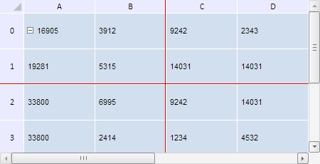

# TabSheetSettings.FixedBehaviour

TabSheetSettings.FixedBehaviour
-

**

# TabSheetSettings.FixedBehaviour

## Синтаксис

FixedBehaviour: PP.Ui.[TabFixedBehaviour](../../Enums/TabFixedBehaviour.htm)

## Описание

Свойство FixedBehaviour**
 указывает, будут ли фиксированные строки и столбцы выделяться полностью
 при нажатии на них.

## Комментарии

Значение свойства можно установить из JSON и с помощью метода setFixedBehaviour, а возвратить
 - с помощью метода getFixedBehaviour.

По умолчанию значение свойства равно null.

## Пример

Для выполнения примера необходимо наличие на html-странице компонента
 [TabSheet](../../Components/TabSheet/TabSheet/TabSheet.htm)
 с наименованием «tabSheet» (см. «[Пример
 создания компонента TabSheet](../../Components/TabSheet/TabSheet/TabSheet_Example.htm)»). Зафиксируем первые две строки и первые
 два столбца таблицы и сделаем так, чтобы они не выделялись при нажатии
 на них:

// Зададим крайний фиксированный столбец
tabSheet.setFixedColumn(1);
// Зададим крайнюю фиксированную строку
tabSheet.setFixedRow(1);
// Установим цвет линий фиксации
tabSheet.setFixedLineColor("#CC0000");
};
// Отобразим линии фиксации
tabSheet.setDisplayFixedAreaLines(true);
// Выведем первые видимые столбец и строку в таблице, не считая зафиксированных
console.log("Первый видимый нефиксированный столбец: " + tabSheet.getFirstVisibleColumn());
console.log("Первая видимая нефиксированная строка: " + tabSheet.getFirstVisibleRow());
// Указываем, что фиксированные строки/столбцы не будут выделяться при нажатии на них
tabSheet.setFixedBehaviour(PP.Ui.TabFixedBehaviour.Off);
// Увеличим размеры таблицы
tabSheet.setWidth(450);
tabSheet.setHeight(230);

В результате выполнения примера были зафиксированы первые две строки
 и первые два столбца таблицы. Теперь при нажатии они не выделяются:

Линия фиксации имеет красный цвет.

Также в консоли браузера были выведены сообщения с индексами столбца
 и строки таблицы, являющихся первыми видимыми из всех нефиксированных
 элементов:

Первый видимый нефиксированный столбец: 2

Первая видимая нефиксированная строка: 2

См. также:

[TabSheetSettings](TabSheetSettings.htm)

		Справочная
		 система на версию 10.9
		 от 18/08/2025,
		 © ООО «ФОРСАЙТ»,
