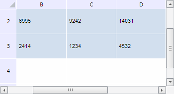

# TabSheetSettings.FixedHeaders

TabSheetSettings.FixedHeaders
-

**

# TabSheetSettings.FixedHeaders

## Синтаксис

FixedHeaders: Boolean

## Описание

Свойство FixedHeaders**
 управляет фиксацией заголовков таблицы.

## Комментарии

Значение свойства устанавливается из JSON и с помощью метода setFixedHeaders,
 а возвращается - с помощью метода getFixedHeaders.

Если заголовки таблицы зафиксированы, то свойство содержит значение
 true, в противном случае
 - false.

По умолчанию свойство содержит значение true.

## Пример

Для выполнения примера необходимо наличие на html-странице компонента
 [TabSheet](../../Components/TabSheet/TabSheet/TabSheet.htm)
 с наименованием «tabSheet» (см. «[Пример
 создания компонента TabSheet](../../Components/TabSheet/TabSheet/TabSheet_Example.htm)»). Разрешим, а затем запретим фиксацию
 заголовков, выводя в каждом случае количество зафиксированных строк и
 столбцов таблицы:

// Зададим крайний фиксированный столбец
tabSheet.setFixedColumn(1);
// Зададим крайнюю фиксированную строку
tabSheet.setFixedRow(2);
// Разрешим фиксацию заголовков
tabSheet.setFixedHeaders(true);
console.log("Фиксация заголовков разрешена.");
// Выполним подсчет количества зафиксированных столбцов и строк
console.log("  Количество зафиксированных столбцов: " + tabSheet.getFixedColumnCount());
console.log("  Количество зафиксированных строк: " + tabSheet.getFixedRowCount());
// Запретим фиксацию заголовков
tabSheet.setFixedHeaders(false);
console.log("Фиксация заголовков запрещена.");
// Выполним подсчет количества зафиксированных столбцов и строк
console.log("  Количество зафиксированных столбцов: " + tabSheet.getFixedColumnCount());
console.log("  Количество зафиксированных строк: " + tabSheet.getFixedRowCount());

В результате выполнения примера были зафиксированы два столбца и три
 строки таблицы, при этом видимым будет диапазон таблицы с верхней левой
 ячейкой B2:

Затем, разрешая и запрещая фиксацию заголовков, было подсчитано и выведено
 в консоль браузера количество зафиксированных столбцов и строк:

Фиксация заголовков разрешена.

  Количество зафиксированных столбцов: 2

  Количество зафиксированных строк: 3

Фиксация заголовков запрещена.

  Количество зафиксированных столбцов: 0

  Количество зафиксированных строк: 0

См. также:

[TabSheetSettings](TabSheetSettings.htm)

		Справочная
		 система на версию 10.9
		 от 18/08/2025,
		 © ООО «ФОРСАЙТ»,
