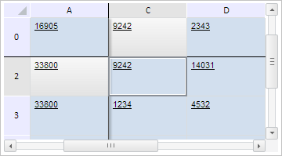

# TabSheetSettings.HeadersHighlightingStyle

TabSheetSettings.HeadersHighlightingStyle
-

# TabSheetSettings.HeadersHighlightingStyle

## Синтаксис

HeadersHighlightingStyle: String;

## Описание

Свойство HeadersHighlightingStyle
 определяет стиль заголовков выделенных ячеек.

## Комментарии

Значение свойства устанавливается из JSON и с помощью метода setHeadersHighlightingStyle,
 а возвращается с помощью метода getHeadersHighlightingStyle.

## Пример

Для выполнения примера необходимо наличие на html-странице компонента
 [TabSheet](../../Components/TabSheet/TabSheet/TabSheet.htm)
 с наименованием «tabSheet» (см. «[Пример
 создания компонента TabSheet](../../Components/TabSheet/TabSheet/TabSheet_Example.htm)»). Установим стиль заголовков выделенных
 ячеек, установим крайние фиксированные строку и столбец, запретим отображение
 тени под фиксированными строками, разрешим отображение тени правее фиксированных
 столбцов. Выполним прокрутку к указанным столбцу и строке, выделим указанную
 ячейку:

// Установим стиль заголовков при выделении ячеек
tabSheet.setHeadersHighlightingStyle("PPRelease");
// Установим крайний фиксированный столбец
tabSheet.setFixedColumn(0);
// Установим крайнюю фиксированную строку
tabSheet.setFixedRow(0);
// Запретим отображение тени под фиксированными строками
tabSheet.setShowHorizontalFixedShadow(false);
// Разрешим отображение тени правее фиксированных столбцов
tabSheet.setShowVerticalFixedShadow(true);
// Выполним прокрутку к указанному столбцу и строке
tabSheet.scrollToColumn(2);
tabSheet.scrollToRow(2);
// Получим ячейку в указанном диапазоне
var range = tabSheet.getRangeFromString("C2:C2");
// Выделим полученную ячейку
range.select();
В результате выполнения примера был установлен стиль заголовков выделенных
 ячеек, были установлены крайние фиксированные строка и столбец, было запрещено
 отображение тени под фиксированными строками и разрешено отображение тени
 правее фиксированных столбцов. Была выполнена прокрутка к указанным столбцу
 и строке, была выделена указанная ячейка:

См. также:

[TabSheetSettings](TabSheetSettings.htm)

		Справочная
		 система на версию 10.9
		 от 18/08/2025,
		 © ООО «ФОРСАЙТ»,
