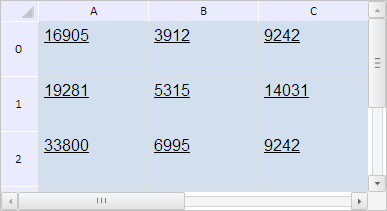

# TabSheetSettings.PTFontSize

TabSheetSettings.PTFontSize
-

# TabSheetSettings.PTFontSize

## Синтаксис

PTFontSize: Boolean;

## Описание

Свойство PTFontSize определяет
 признак задания размера шрифта в пунктах.

## Комментарии

Значение свойства устанавливается из JSON и с помощью метода setPTFontSize,
 а возвращается с помощью метода getPTFontSize.

Если свойство имеет значение true,
 то размер шрифта будет задан в пунктах, иначе - в пикселях (по умолчанию).

## Пример

Для выполнения примера необходимо наличие на html-странице компонента
 [TabSheet](../../Components/TabSheet/TabSheet/TabSheet.htm)
 с наименованием «tabSheet» (см. «[Пример
 создания компонента TabSheet](../../Components/TabSheet/TabSheet/TabSheet_Example.htm)»). Установим размер шрифта в пунктах:

tabSheet.setPTFontSize(true);
// Обновим таблицу
tabSheet.update();
В результате выполнения примера для таблицы был установлен размер шрифта
 в пунктах:

См. также:

[TabSheetSettings](TabSheetSettings.htm)

		Справочная
		 система на версию 10.9
		 от 18/08/2025,
		 © ООО «ФОРСАЙТ»,
