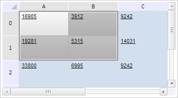

# TabSheetSettings.ReturnSelectionAfterFocus

TabSheetSettings.ReturnSelectionAfterFocus
-

# TabSheetSettings.ReturnSelectionAfterFocus

## Синтаксис

ReturnSelectionAfterFocus: Boolean;

## Описание

Свойство ReturnSelectionAfterFocus
 определяет возможность восстановления области выделения ячеек после
 возвращения фокуса таблице.

## Комментарии

Значение свойства устанавливается из JSON и с помощью метода setReturnSelectionAfterFocus,
 а возвращается с помощью метода getReturnSelectionAfterFocus.

Если свойство имеет значение true,
 то после возвращения фокуса таблице область выделения ячеек будет восстановлена,
 иначе - не будет.

## Пример

Для выполнения примера необходимо наличие на html-странице компонента
 [TabSheet](../../Components/TabSheet/TabSheet/TabSheet.htm)
 с наименованием «tabSheet» (см. «[Пример
 создания компонента TabSheet](../../Components/TabSheet/TabSheet/TabSheet_Example.htm)»). Установим для ячеек, входящих
 в область выделения таблицы, новый стиль, выделим диапазон A0:B1 и разрешим
 восстановление области выделения ячеек после возвращения фокуса таблице:

// Установим для выделенных ячеек новый стиль
tabSheet.setSelectedCellStyle("PPRelease");
// Получим диапазон ячеек
var range = tabSheet.getRangeFromString("A0:B1");
// Выделим полученный диапазон
range.select();
// Разрешим восстановление области выделения после возвращения фокуса таблице
tabSheet.setReturnSelectionAfterFocus(true);
В результате выполнения примера был выделен диапазон A0:B1. Для ячеек,
 входящих в область выделения, был применён стиль «PPRelease»:

После потери фокуса таблицей область выделения ячеек будет удалена,
 а после возвращения фокуса она будет восстановлена.

См. также:

[TabSheetSettings](TabSheetSettings.htm)

		Справочная
		 система на версию 10.9
		 от 18/08/2025,
		 © ООО «ФОРСАЙТ»,
