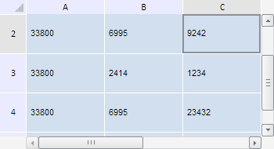

# TabSheetSettings.VerticalExpandVolume

TabSheetSettings.VerticalExpandVolume
-

**

# TabSheetSettings.VerticalExpandVolume

## Синтаксис

VerticalExpandVolume: Number

## Описание

Свойство VerticalExpandVolume**
 определяет, на какое количество столбцов больше (сверху и снизу) будет
 выполняться запрос к источнику данных.

## Комментарии

Значение свойства устанавливается из JSON и с помощью метода setHorizontalExpandVolume,
 а возвращается - с помощью метода getHorizontalExpandVolume.

По умолчанию свойство содержит значение 5.

## Пример

Для выполнения примера необходимо наличие на html-странице компонента
 [TabSheet](../../Components/TabSheet/TabSheet/TabSheet.htm)
 с наименованием «tabSheet» (см. «[Пример
 создания компонента TabSheet](../../Components/TabSheet/TabSheet/TabSheet_Example.htm)»). Выполним прокрутку таблицы вниз, а
 также изменим вид полос прокрутки, чтобы они не охватывали всю таблицу:

// Установим количество столбцов в буфере асинхронного режима
tabSheet.setVerticalExpandVolume(2);
// Получим элемент вертикальной прокрутки
var hScrollBar = tabSheet.getVScrollBar();
// Выполним вертикальную прокрутку
hScrollBar.scrollTo(50, true);
// Изменим вид панелей прокрутки
tabSheet.setIsScrollBarPartial(true);
В результате выполнения примера таблица была прокручена вниз на 50 пикселей,
 размер буфера в асинхронном режиме для столбцов таблицы стало равным 2,
 а полосы прокрутки теперь не охватывают всю таблицу:

См. также:

[TabSheetSettings](TabSheetSettings.htm)

		Справочная
		 система на версию 10.9
		 от 18/08/2025,
		 © ООО «ФОРСАЙТ»,
