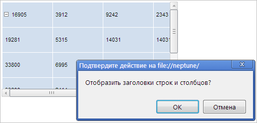

# TabSheetSettings.VisibleHeaders

TabSheetSettings.VisibleHeaders
-

**

# TabSheetSettings.VisibleHeaders

## Синтаксис

VisibleHeaders: Boolean

## Описание

Свойство VisibleHeaders**
 управляет видимостью заголовков строк и столбцов таблицы.

## Комментарии

Значение свойства устанавливается с помощью метода setVisibleHeaders,
 а возвращается - с помощью метода getVisibleHeaders.
 Из JSON значение свойства задать нельзя.

Если свойство равно true, то
 заголовки столбцов таблицы будут отображаться, иначе - не будут.

По умолчанию свойство равно null.

## Пример

Для выполнения примера необходимо наличие на html-странице компонента
 [TabSheet](../../Components/TabSheet/TabSheet/TabSheet.htm)
 с наименованием «tabSheet» (см. «[Пример
 создания компонента TabSheet](../../Components/TabSheet/TabSheet/TabSheet_Example.htm)»). Скрыв по-отдельности заголовки строк
 и столбцов таблицы, а также сетку, отобразим заголовки таблицы вновь:

// Скроем заголовки столбцов
tabSheet.setVisibleColHeaders(false);
// Скроем заголовки строк
tabSheet.setVisibleRowHeaders(false);
var isShowHearders = confirm("Отобразить заголовки строк и столбцов?");
if (isShowHearders) {
    // Отобразим заголовки строк и столбцов таблицы
    tabSheet.setVisibleHeaders(true);
}

В результате выполнения примера были скрыты заголовки строк и столбцов
 таблицы, а также было выведено сообщение, запрашивающее подтверждение
 на отображение заголовков строк и столбцов:

Нажмём на кнопку «OK», и после этого заголовки строк и столбцов таблицы
 будут снова отображены:

См. также:

[TabSheetSettings](TabSheetSettings.htm)

		Справочная
		 система на версию 10.9
		 от 18/08/2025,
		 © ООО «ФОРСАЙТ»,
