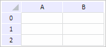

# TabSheetSettings.VisibleNormalPictures

TabSheetSettings.VisibleNormalPictures
-

# TabSheetSettings.VisibleNormalPictures

## Синтаксис

VisibleNormalPictures: Boolean;

## Описание

Свойство VisibleNormalPictures
 определяет признак отображения картинок в ячейках таблицы.

## Комментарии

Значение свойства можно установить из JSON и с помощью метода setVisibleNormalPictures, а возвратить
 - с помощью метода getVisibleNormalPictures.

Если свойство имеет значение true,
 то картинки в ячейках таблицы будут отображаться, иначе - не будут.

## Пример

Для выполнения примера необходимо наличие на html-странице компонента
 [TabSheet](../../Components/TabSheet/TabSheet/TabSheet.htm)
 с наименованием «component», пример создания которого описан в методе
 [TabSheet.setCellPictureSettings](../../Classes/TabSheet/TabSheet/TabSheet.setCellPictureSettings.htm).

Обработаем событие [PictureMouseDown](../../Classes/TabSheet/TabSheet/TabSheet.PictureMouseDown.htm):

// Обработаем событие PictureMouseDown
component.PictureMouseDown.add(function (sender, eventArgs) {
    console.log("Инициировано событие PictureMouseDown");
});
Щёлкнем по картинке в ячейке таблицы, после чего
 в консоли браузера будет выведено сообщение о вызове обработанного ранее
 события:

Инициировано событие PictureMouseDown

Скроем все картинки таблицы:

// Скроем картинки
component.setVisibleNormalPictures(false);
В результате были скрыты картинки таблицы:

См. также:

[TabSheetSettings](TabSheetSettings.htm)

		Справочная
		 система на версию 10.9
		 от 18/08/2025,
		 © ООО «ФОРСАЙТ»,
