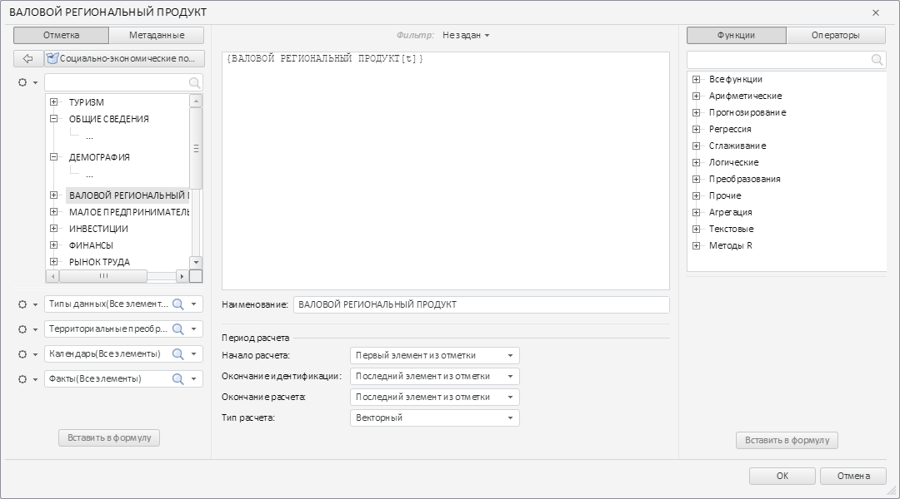
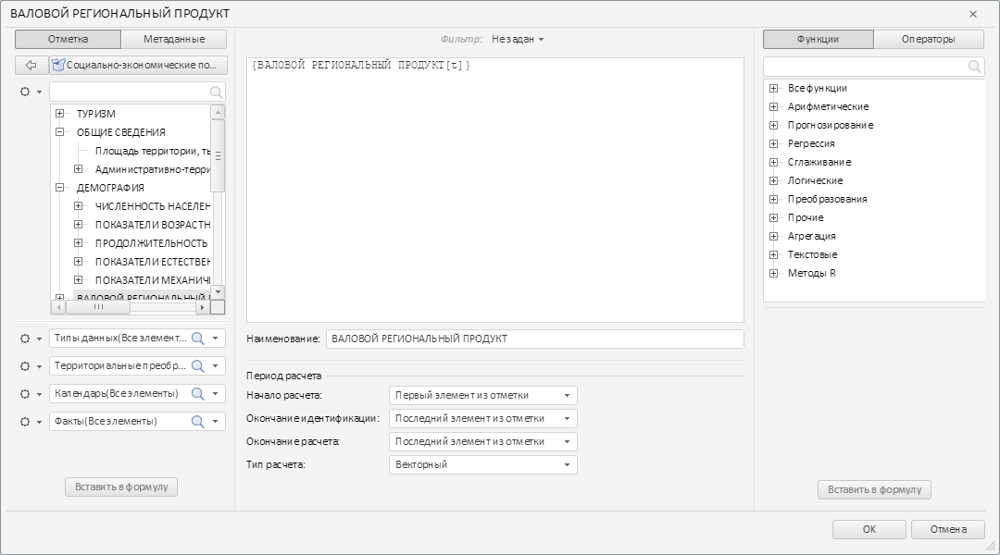

# ExpressionService.beginBatch

ExpressionService.beginBatch
-

# ExpressionService.beginBatch

## Синтаксис

beginBatch(bIgnoreError: Boolean);

## Параметры

bIgnoreError. Признак независимой
 обработки запросов в пакете. Если для параметра установлено значение true, то запросы в пакете будут
 обрабатываться независимо.

## Описание

Метод beginBatch включает пакетный
 режим отправки запросов.

## Комментарии

Отключение пакетного режима отправки запросов производится с помощью
 метода [endBatch](ExpressionService.endBatch.htm).

## Пример

Для выполнения примера необходимо наличие на html-странице компонента
 [TransformDialog](../../../Components/TransformDialog/TransformDialog.htm)
 с наименованием «dialog» (см. «[Пример
 создания компонента TransformDialog](../../../Components/TransformDialog/Example_TransformDialog.htm)»). Получим сервис выражений и
 проверим, включен ли пакетный режим отправки запросов, и, если не включен,
 то включим его:

// Получаем сервис выражений
PP.Object.defineProps(PP.Ufe.Ui.TransformDialog, 'ExpService', true);
var expService = dialog.getExpService();
// Проверяем, включен ли пакетный режим отправки запросов
if (expService.getIsBatchMode()) {
    console.log("Пакетный режим отправки запросов включен");
} else {
    console.log("Пакетный режим отправки запросов не был включен");
    expService.beginBatch();
}
В консоль было выведено сообщение о проверке включения пакетного режима
 отправки запросов:

Пакетный режим отправки запросов не был включен

Раскроем вручную элементы дерева в левой панели окна. Элементы
 раскроются, но будут пустыми:

Отключим пакетный режим отправки запросов:

// Отключаем пакетный режим отправки запросов
expService.endBatch();
После отключения пакетного режима отправки запросов будет отправлен
 запрос на сервер и содержимое раскрытых элементов будет загружено:

См. также:

[ExpressionService](ExpressionService.htm)

		Справочная
		 система на версию 10.9
		 от 18/08/2025,
		 © ООО «ФОРСАЙТ»,
