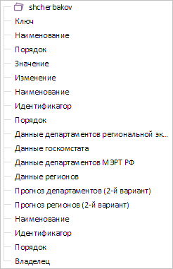

# MetaSource.ChildEls

MetaSource.ChildEls
-

# MetaSource.ChildEls

## Синтаксис

ChildEls: Array;

## Описание

Свойство ChildEls определяет
 дочерние элементы у родительского элемента модели дерева.

## Комментарии

Значение свойства устанавливается с помощью метода setChildEls,
 а возвращается с помощью метода getChildEls.
 Из JSON задать значение нельзя.

Параметры метода setChildEls:

- parentKey: String. Ключ родительского
 элемента;

- mdEls: Array. Массив добавляемых
 объектов;

- range: Object. Диапазон загруженных
 элементов;

- childrenCount: Number. Общее
 количество дочерних элементов для родительского элемента;

- filter: PP.Mb.ElsFilter.
 Фильтр, устанавливаемый всем загруженным элементам;

- odId :Object. Моникёр измерения.

Параметры метода getChildEls:

- key: String. Ключ родительского
 элемента;

- range: Object. Диапазон получаемых
 элементов;

- filter: PP.Mb.ElsFilter.
 Фильтр, которому удовлетворяют дочерние элементы;

- odId :Object. Моникёр измерения.

## Пример

Для выполнения примера необходимо наличие на html-странице объекта типа
 [MetaTree](../../PP_Ufe_Ui/MetaTree/MetaTree.htm) с наименованием
 «metaTree» (см. «[Конструктор
 MetaTree](../../PP_Ufe_Ui/MetaTree/Constructor_MetaTree.htm)»). Раскроем все элементы дерева:

metaTree.expandAll();
Теперь отобразим в дереве только те элементы, у которых отсутствуют
 дочерние элементы:

var elements = [];
// Получаем все элементы дерева
getChildElements("");
function getChildElements(key) {
    var childEls = metaSource.getChildEls(key);
    for(var i in childEls) {
        if(childEls[i].childrenCount) {
            getChildElements(childEls[i].k.toString());
        } else {
            elements.push(childEls[i]);
        }
    }
}
// Устанавливаем элементы
metaSource.setChildEls("", elements);
// Обновляем дерево элементов
metaTree.refreshAll();
В результате выполнения примера были отображены только элементы, не
 имеющие дочерних элементов:

См. также:

[MetaSource](MetaSource.htm)

		Справочная
		 система на версию 10.9
		 от 18/08/2025,
		 © ООО «ФОРСАЙТ»,
