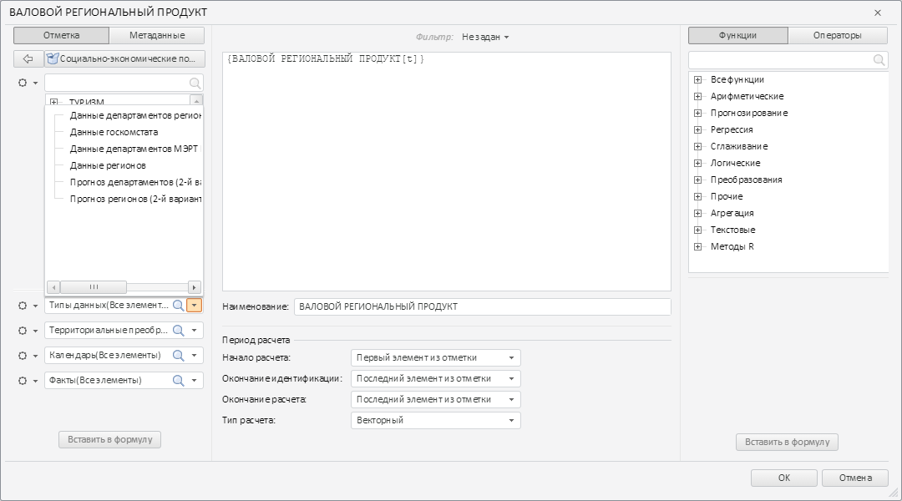

# CollapsedDimPanel.getDimTreeView

CollapsedDimPanel.getDimTreeView
-

# CollapsedDimPanel.getDimTreeView

## Синтаксис

getDimTreeView();

## Описание

Метод getDimTreeView возвращает
 дерево раскрывающейся панели с элементами выбранного измерения.

## Комментарии

Метод возвращает объект типа PP.Mb.Ui.DimTree.

## Пример

Для выполнения примера необходимо наличие на html-странице компонента
 [TransformDialog](../../../Components/TransformDialog/TransformDialog.htm)
 с наименованием «dialog» (см. «[Пример
 создания компонента TransformDialog](../../../Components/TransformDialog/Example_TransformDialog.htm)»). Раскроем первый раскрывающийся
 список левой панели компонента [TransformDialog](../TransformDialog/TransformDialog.htm):

// Получаем первый раскрывающийся список
PP.Object.defineProps(PP.Ufe.Ui.TransformDialog, 'LeftPanel', true);
PP.Object.defineProps(PP.Ufe.Ui.TransformDialogLeftPanel, 'collapsedPanels', true);
var collapsedPanel = dialog.getLeftPanel().getcollapsedPanels()[0];
// Открываем раскрывающуюся панель
collapsedPanel.getDimCombo().getControl().showDropPanel();
В результате был раскрыт первый раскрывающийся список левой панели компонента
 [TransformDialog](../TransformDialog/TransformDialog.htm):

Вручную выделим третью вершину дерева в раскрытом списке. Затем определим
 ключи всех выделенных элементов дерева:

// Получим дерево с элементами измерения
var dimTree = collapsedPanel.getDimTreeView();
// Получаем ключи выделенных элементов дерева
console.log("Выделенные элементы дерева:");
for (var i in dimTree.getSelectedNodes()) {
    console.log(dimTree.getSelectedNodes()[i]);
}
В результате выполнения примера в консоль были выведены ключи выделенных
 элементов дерева:

Выделенные элементы дерева:

2

См. также:

[CollapsedDimPanel](CollapsedDimPanel.htm)

		Справочная
		 система на версию 10.9
		 от 18/08/2025,
		 © ООО «ФОРСАЙТ»,
