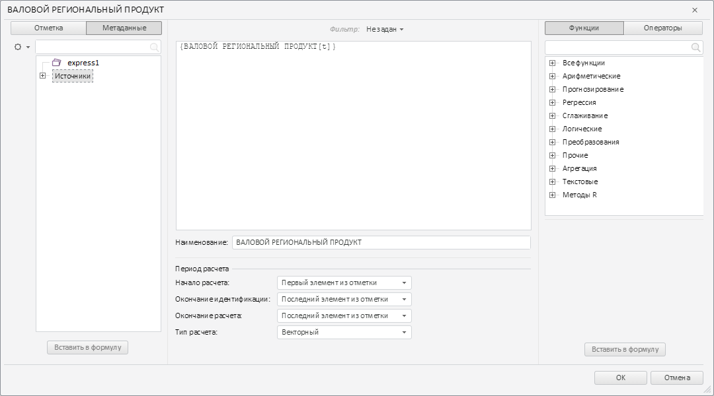

# ExpandedDimPanel.getMetaTree

ExpandedDimPanel.getMetaTree
-

# ExpandedDimPanel.getMetaTree

## Синтаксис

getMetaTree();

## Описание

Метод getMetaTree возвращает
 дерево метаданных измерения компонента [TransformDialog](../TransformDialog/TransformDialog.htm).

## Комментарии

Возвращаемое значение - экземпляр класса PP.Ufe.Ui.[MetaTree](../MetaTree/MetaTree.htm).

## Пример

Для выполнения примера необходимо наличие на html-странице компонента
 [TransformDialog](../../../Components/TransformDialog/TransformDialog.htm)
 с наименованием «dialog» (см. «[Пример
 создания компонента TransformDialog](../../../Components/TransformDialog/Example_TransformDialog.htm)»). На левой панели компонента
 необходимо открыть вкладку с наименование «Метаданные». Получим режим
 отображения вершин дерева метаданных измерения:

// Получаем панель с деревом метаданных измерения
PP.Object.defineProps(PP.Ufe.Ui.TransformDialog, 'LeftPanel', true);
PP.Object.defineProps(PP.Ufe.Ui.TransformDialogLeftPanel, 'metaPanel', true);
var expandedPanel = dialog.getLeftPanel().getmetaPanel();
// Получаем режим отображения вершин дерева метаданных
console.log("Режим отображения вершин дерева метаданных: " + expandedPanel.getMetaTree().getDisplayMode());
В результате в консоль был выведен режим отображения вершин дерева метаданных
 измерения:

Режим отображения вершин дерева метаданных: Name

Выделим элемент в дереве метаданных измерения:

Получим наименование выделенной вершины дерева:

// Получаем наименование выделенной вершины элемента
console.log("Наименование выделенной вершины элемента: " + expandedPanel.getMetaTreeSelectedNodeData().n);
В результате в консоль было выведено наименование выделенной вершины
 дерева:

Наименование выделенной вершины элемента: Источники

См. также:

[ExpandedDimPanel](ExpandedDimPanel.htm)

		Справочная
		 система на версию 10.9
		 от 18/08/2025,
		 © ООО «ФОРСАЙТ»,
