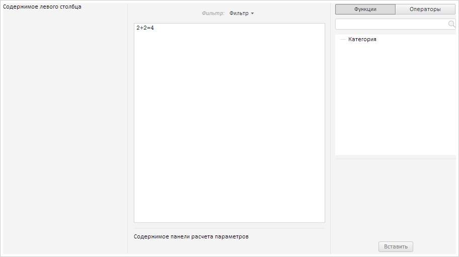
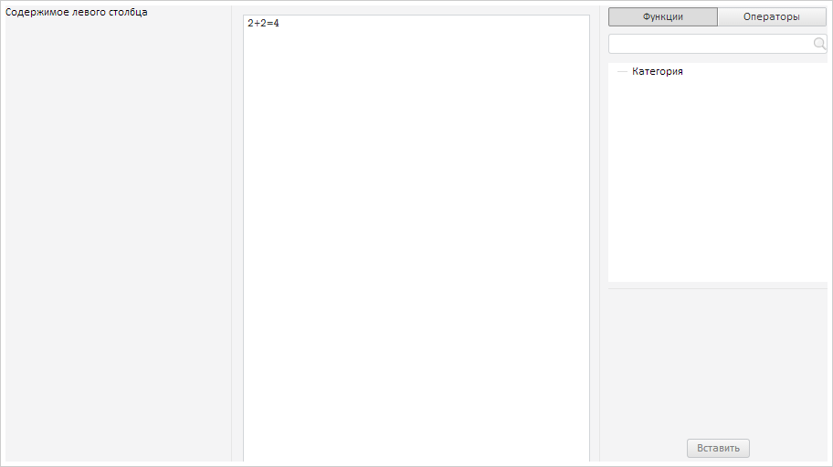

# FormulaEditor.CalcParamsPanelResized

FormulaEditor.CalcParamsPanelResized
-

# FormulaEditor.CalcParamsPanelResized

## Синтаксис

CalcParamsPanelResized: function(sender, args);

## Параметры

sender. Источник
 события;

args. Информация о событии.
 Аргументы: Panel - изменяемая
 панель.

## Описание

Событие CalcParamsPanelResized
 наступает после изменения размера панели расчета параметров редактора
 выражения.

## Пример

Для выполнения примера предполагается наличие на странице компонента
 [FormulaEditor](FormulaEditor.htm) с наименованием «formulaEditor»
 (см. «[Пример
 создания компонента FormulaEditor](../../../Components/FormulaEditor/Example_FormulaEditor.htm)»). Пример нужно разместить в теге
 <script>. Добавим обработчик события изменения размера панели расчета
 параметров:

// Добавляем обработчик изменения размера панели расчета параметров
formulaEditor.CalcParamsPanelResized.add(function (sender, args) {
    console.log("Изменен размер панели расчета параметров");
});
Изменим размер панели расчета параметров:

В консоль будет выведено сообщение об изменении размера панели расчета
 параметров:

Изменен размер панели расчета параметров

Получаем высоту панели расчета параметров:

console.log("Высота панели расчета параметров: " + formulaEditor.getCalcParamsContainer().getHeight());
В консоль будет выведено значение высоты панели расчета параметров:

Высота панели расчета параметров: 68

Скрываем панели расчета параметров и фильтрации:

// Скрываем панель фильтрации
formulaEditor.setFilterPanelVisibility(false);
// Скрываем панель расчета параметров
formulaEditor.setCalcParamsVisibility(false);
В результате панели расчета параметров и фильтрации будут скрыты:

См. также:

[FormulaEditor](FormulaEditor.htm)

		Справочная
		 система на версию 10.9
		 от 18/08/2025,
		 © ООО «ФОРСАЙТ»,
