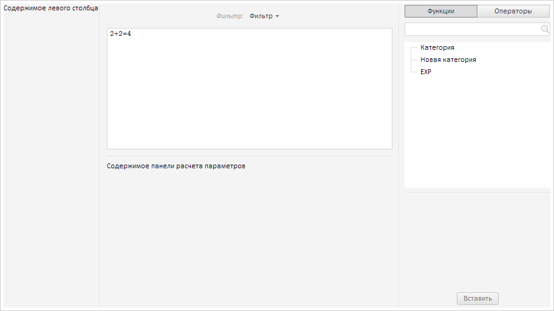

# FormulaEditor.LeftPanelResized

FormulaEditor.LeftPanelResized
-

# FormulaEditor.LeftPanelResized

## Синтаксис

LeftPanelResized: function(sender, args);

## Параметры

sender. Источник
 события;

args. Информация о событии.

## Описание

Событие LeftPanelResized наступает
 после изменения размера левой панели редактора выражения.

## Пример

Для выполнения примера предполагается наличие на странице компонента
 [FormulaEditor](FormulaEditor.htm) с наименованием «formulaEditor»
 (см. «[Пример
 создания компонента FormulaEditor](../../../Components/FormulaEditor/Example_FormulaEditor.htm)»). Пример нужно разместить в теге
 <script>. Добавим обработчик события изменения размера левой панели
 редактора выражений:

// Добавляем обработчик события изменения размера левой панели
formulaEditor.LeftPanelResized.add(function (sender, args) {
    console.log("Изменен размер левой панели");
});
Изменим размер левой панели:

В консоль будет выведено сообщение об изменении размера левой панели:

Изменен размер левой панели

См. также:

[FormulaEditor](FormulaEditor.htm)

		Справочная
		 система на версию 10.9
		 от 18/08/2025,
		 © ООО «ФОРСАЙТ»,
