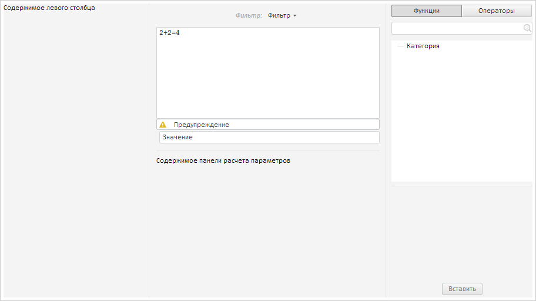

# FormulaEditor.NamingTextBox

FormulaEditor.NamingTextBox
-

# FormulaEditor.NamingTextBox

## Синтаксис

NamingTextBox: [PP.Ui.TextBox](dhtmlUi.chm::/Classes/TextBox/TextBox.htm);

## Описание

Свойство NamingTextBox устанавливает
 текстовое поле контейнера «Наименование».

## Комментарии

Контейнер «Наименование» находится под панелью вычисления.

Свойство предназначено только для чтения.

## Пример

Для выполнения примера предполагается наличие на странице компонента
 [FormulaEditor](FormulaEditor.htm) с наименованием «formulaEditor»
 (см. «[Пример
 создания компонента FormulaEditor](../../../Components/FormulaEditor/Example_FormulaEditor.htm)»). Отобразим контейнер «Наименование»
 и кнопку «Предупреждение» у редактора выражений:

// Отображаем контейнер «Наименование»
formulaEditor.setIsNamingVisible(true);
// Отображаем кнопку «Предупреждение»
formulaEditor.setWarningMessage("Предупреждение", 2);
// Добавляем строку в текстовое поле контейнера «Наименование»
formulaEditor.getNamingTextBox().setContent("Значение");
В результате в редактор выражений будут добавлены контейнер «Наименование»
 с текстом и кнопка «Предупреждение»:

После нажатия на кнопку «Предупреждение» курсор будет перемещен за символ
 «+».

См. также:

[FormulaEditor](FormulaEditor.htm)

		Справочная
		 система на версию 10.9
		 от 18/08/2025,
		 © ООО «ФОРСАЙТ»,
