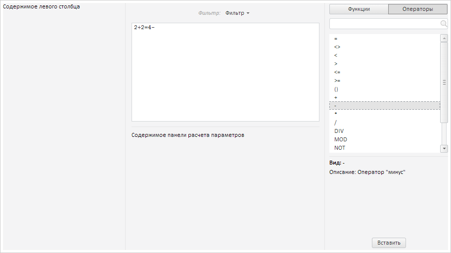

# FormulaEditor.TermsChanged

FormulaEditor.TermsChanged
-

# FormulaEditor.TermsChanged

## Синтаксис

TermsChanged: function(sender, args);

## Параметры

sender. Источник
 события;

args. Информация о событии.

## Описание

Событие TermsChanged наступает
 после изменения термов редактора выражения.

## Пример

Для выполнения примера предполагается наличие на странице компонента
 [FormulaEditor](FormulaEditor.htm) с наименованием «formulaEditor»
 (см. «[Пример
 создания компонента FormulaEditor](../../../Components/FormulaEditor/Example_FormulaEditor.htm)»). Добавим обработчики событий изменения
 термов и добавления терма из списка:

// Добавляем обработчик события изменения термов в редакторе термов
formulaEditor.TermsChanged.add(function (sender, args) {
    console.log("Изменено значение терма");
});
// Добавляем обработчик события добавления терма из списка
formulaEditor.TermDrop.add(function (sender, args) {
    console.log("Терм добавлен из списка");
});
Добавим терм из списка операторов:

В консоль будет выведена информация о добавлении терма из списка:

Терм добавлен из списка

Получаем позицию курсора в редакторе выражений:

console.log("Позиция курсора: " + formulaEditor.getCaretPosition());
В консоль будет выведена позиция курсора:

Позиция курсора: 6

Добавляем терм с содержимым «0»:

formulaEditor.insertTerm("0");
В результате будет добавлен новый терм:

В консоль будет выведено сообщение об изменении терма:

Изменено значение терма

Получаем длину выражения и конечную формулу:

// Получаем длину выражения
console.log("Длина выражения: " + formulaEditor.getTermEdit().getLength());
// Получаем конечную формулу
console.log("Конечная формула: " + formulaEditor.getFormula());
В результате в консоль будут выведены длина выражения и конечная формула:

Длина выражения: 7

Конечная формула: 2+2=4-0

См. также:

[FormulaEditor](FormulaEditor.htm)

		Справочная
		 система на версию 10.9
		 от 18/08/2025,
		 © ООО «ФОРСАЙТ»,
