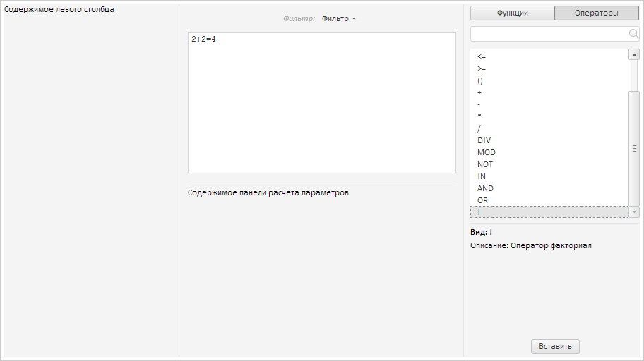

# FormulaEditor.addOperator

FormulaEditor.addOperator
-

# FormulaEditor.addOperator

## Синтаксис

addOperator(settings: Object);

## Параметры

settings. JSON-объект
 с параметрами добавляемого оператора. Объект должен содержать следующие
 поля: Text - текстовое значение
 оператора; Desc - описание оператора.

## Описание

Метод addOperator добавляет
 оператор в список операторов.

## Пример

Для выполнения примера предполагается наличие на странице компонента
 [FormulaEditor](FormulaEditor.htm) с наименованием «formulaEditor»
 (см. «[Пример
 создания компонента FormulaEditor](../../../Components/FormulaEditor/Example_FormulaEditor.htm)»). Пример нужно разместить в теге
 <script>. Получим список исходных операторов:

// Получаем исходные операторы
console.log("Исходные операторы:");
for (var i in formulaEditor.getInitialOperators()) {
    console.log(formulaEditor.getInitialOperators()[i].Content);
}
В результате в консоль будет выведен список исходных операторов:

Исходные операторы:

=

<>

<

>

<=

>=

()

+

-

*

/

DIV

MOD

NOT

IN

AND

OR

Добавляем оператор в список операторов редактора выражений:

// Добавляем оператор
formulaEditor.addOperator({
    Text: "!",
    Desc: {
        Entity: "!",
        Descr: "Оператор факториал",
        LinkToFullDescr: "#"
    },
});
В результате в список операторов будет добавлен новый оператор. При
 выборе оператора будет выведена информация о нем:

См. также:

[FormulaEditor](FormulaEditor.htm)

		Справочная
		 система на версию 10.9
		 от 18/08/2025,
		 © ООО «ФОРСАЙТ»,
