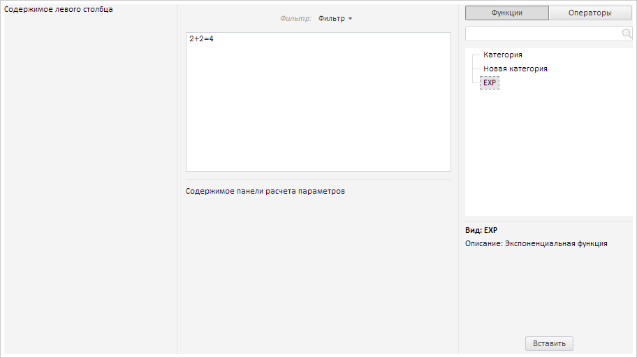
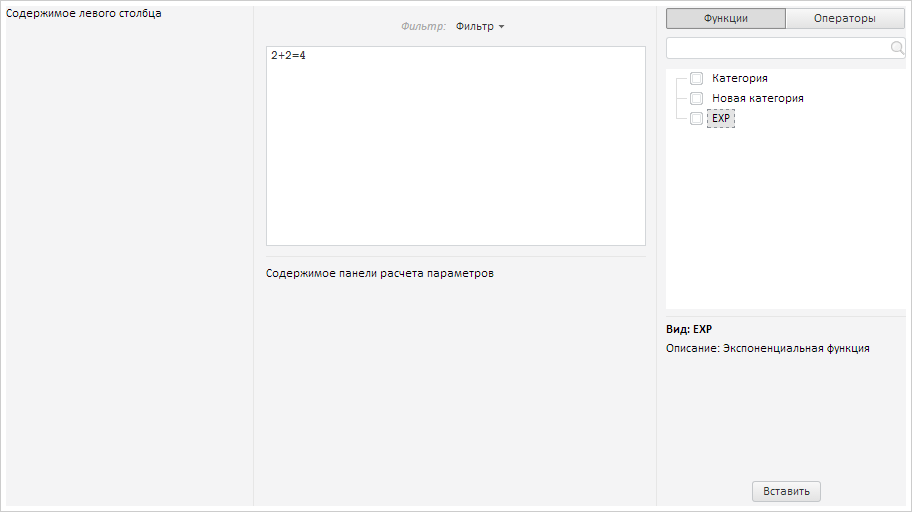

# FormulaEditor.getFunctionList

FormulaEditor.getFunctionList
-

# FormulaEditor.getFunctionList

## Синтаксис

getFunctionList();

## Описание

Метод getFunctionList возвращает
 список функций редактора выражения.

## Комментарии

Возвращаемое значение - экземпляр класса PP.Ui.[TreeList](dhtmlUiTree.chm::/Classes/TreeList/TreeList.htm).

## Пример

Для выполнения примера предполагается наличие на странице компонента
 [FormulaEditor](FormulaEditor.htm) с наименованием «formulaEditor»
 (см. «[Пример
 создания компонента FormulaEditor](../../../Components/FormulaEditor/Example_FormulaEditor.htm)»). Пример нужно разместить в теге
 <script>. Добавим в редактор выражений новую категорию функций и
 функцию:

// Добавляем категорию формул
formulaEditor.addCategory({
    Key: "key1",
    Text: "Новая категория"
});
// Добавляем функцию
formulaEditor.addFunction({
    Text: "EXP",
    Formula: "EXP",
    Desc: {
        Entity: "EXP",
        Descr: "Экспоненциальная функция",
        LinkToFullDescr: "#"
    },
});
В результате на правой панели редактора выражений на вкладке функций
 будут добавлены новая категория и функция. При нажатии на новую функцию
 будет выведено ее описание:

Включим отображение флажков в списке функций:

formulaEditor.getFunctionsList().setCheckBoxes(true);
В результате в списке функций будут добавлены флажки:

См. также:

[FormulaEditor](FormulaEditor.htm)

		Справочная
		 система на версию 10.9
		 от 18/08/2025,
		 © ООО «ФОРСАЙТ»,
