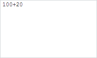

# Term.BecameEmpty

Term.BecameEmpty
-

# Term.BecameEmpty

## Синтаксис

BecameEmpty: function(sender, args);

## Параметры

sender. Источник события;

args. Информация о событии.

## Описание

Событие BecameEmpty наступает
 после того, как терм становится пустым.

## Пример

Для выполнения примера необходимо наличие на html-странице ссылок на
 файлы сценариев PP.js, PP.Ufe.js и файлы стилей PP.css, PP.Ufe.css, в
 теге <body> html-страницы элемента 
 с идентификатором
 «termEdit». Создадим на html-странице редактор термов и добавим несколько
 термов:

function createTerm() {
    // Создаем редактор термов
    termEdit = new PP.Ui.TermEdit({
        // Устанавливаем родительский элемент
        ParentNode: document.getElementById("termEdit")
    });
    // Добавляем строковое значение в редактор
    termEdit.insertString("100");
    // Добавляем данные в редактор
    termEdit.insertData([new PP.Ui.Term({ Content: "+", Formula: "+" })]);
    // Добавляем терм в редактор
    termEdit.insertString("20");
}
В результате в редактор термов будет добавлено несколько термов:

Установим курсор на терм с содержимым «20». Получим выбранный терм и
 добавим ему обработчик события [BecameEmpty](Term.BecameEmpty.htm),
 также получим начальную и конечную позиции терма в выражении и проверим,
 является ли он односимвольным термом:

// Получаем выделенный терм
term = termEdit.getSelectedTerm();
// Добавляем выделенному терму обработку события становления пустым
term.BecameEmpty.add(function (sender, args) {
    console.log("Выбранный терм стал пустым");
}, term);
// Получаем номер позиции начала терма
console.log("Начальная позиции терма: " + term.getStartOffset());
// Получаем номер позиции конца терма
console.log("Конечная позиции терма: " + term.getEndOffset());
// Проверяем, является ли выделенный терм односимвольным термом
if (term.getIsOneCharTerm()) {
    console.log("Выделенный терм является односимвольным термом");
} else {
    console.log("Выделенный терм не является односимвольным термом");
}
В результате в консоль будут выведены начальная и конечная позиции выделенного
 терма:

Начальная позиции терма: 4

Конечная позиции терма: 6

Выделенный терм не является односимвольным термом

Проверим, можно ли редактировать формулу выбранного терма:

// Проверяем, можно ли редактировать формула выбранного терма
if (term.canEditFormula()) {
    console.log("Редактирование формулы терма разрешено");
} else {
    console.log("Редактирование формулы терма запрещено");
}
В результате в консоль будет выведен результат проверки:

Редактирование формулы терма запрещено

Удалим первый и последний символы терма:

// Удаляем последний символ терма
term.deleteLastChar();
// Удаляем первый символ терма
term.deleteFirstChar();
// Обновляем термы редактора
termEdit.updateTerms();
В результате в редакторе термов будет отсутствовать терм с содержимым
 «20»:

В консоль будет выведено сообщение о том, что выделенный терм стал пустым:

Выбранный терм стал пустым

См. также:

[Term](Term.htm)

		Справочная
		 система на версию 10.9
		 от 18/08/2025,
		 © ООО «ФОРСАЙТ»,
