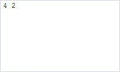

# Term.Splitted

Term.Splitted
-

# Term.Splitted

## Синтаксис

Splitted: function(sender, args);

## Параметры

sender. Источник события;

args. Информация
 о событии. Аргументы: Left
 - левая часть терма после разделения, Middle - разделитель терма, Right
 - правая часть терма после разделения.

## Описание

Событие Splitted наступает после
 разделения терма.

## Пример

Для выполнения примера необходимо наличие на html-странице ссылок на
 файлы сценариев PP.js, PP.Ufe.js и файлы стилей PP.css, PP.Ufe.css, в
 теге <body> html-страницы элемента 
 с идентификатором
 «termEdit». Создадим редактор выражений и добавим терм с содержимым «42»:

function createTerm() {
    // Создаем редактор выражений
    termEdit = new PP.Ufe.Ui.TermEdit({
        // Устанавливаем родительский элемент
        ParentNode: document.getElementById("termEdit")
    });
    termEdit.insertString("42");
}
Установим курсор между символами «4» и «2». Получим выбранный терм и
 установим ему обработчик события [Splitted](Term.Splitted.htm),
 а редактору выражения установим обработчик нажатия клавиши клавиатуры:

// Получаем выбранный терм
term = termEdit.getCaretMetadata().Term;
// Добавляем обработчик события разделения терма
term.Splitted.add(function (sender, args) {
    console.log("Выбранный терм был разделен");
});
Разделим терм пробелом. В результате терм будет разделен на 2 части:

В консоль будет выведено сообщение о разделении терма:

Выбранный терм был разделен

См. также:

[Term](Term.htm)

		Справочная
		 система на версию 10.9
		 от 18/08/2025,
		 © ООО «ФОРСАЙТ»,
