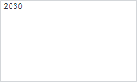

# Term.StartBackspacePressed

Term.StartBackspacePressed
-

# Term.StartBackspacePressed

## Синтаксис

StartBackspacePressed: function(sender, args);

## Параметры

sender. Источник события;

args. Информация
 о событии.

## Описание

Событие StartBackspacePressed
 наступает после нажатия клавиши BACKSPACE, когда курсор располагается
 перед первым символом терма.

## Пример

Для выполнения примера необходимо наличие на html-странице ссылок на
 файлы сценариев PP.js, PP.Ufe.js и файлы стилей PP.css, PP.Ufe.css, в
 теге <body> html-страницы элемента 
 с идентификатором
 «termEdit». Создадим редактор выражений и добавим строку «20+30»:

function createTerm() {
    // Создадим редактор выражений
    termEdit = new PP.Ufe.Ui.TermEdit({
        // Устанавливаем родительский элемент
        ParentNode: document.getElementById("termEdit")
    });
    // Добавляем термы
    termEdit.insertString("20+30");
}
Установим курсор на терм с содержимым «30». Добавим к выбранному терму
 обработчик события [StartBackspacePressed](Term.StartBackspacePressed.htm), а
 редактору выражения установим обработчик нажатия клавиши клавиатуры:

// Получаем выбранный терм
term = termEdit.getSelectedTerm();
// Устанавливаем выбранному терму обработчик события нажатия на клавишу BACKSPACE перед термом
term.StartBackspacePressed.add(function (sender, args) {
    console.log("Нажата клавиша BACKSPACE перед выбранным термом");
});
Установим курсор перед термом с содержимым «30» и нажмем клавишу
 BACKSPACE. В результате будет удален терм с содержимым «+»:

В консоль будет выведено сообщение о нажатие на клавишу BACKSPACE перед
 выбранным термом:

Нажата клавиша BACKSPACE перед выбранным термом

См. также:

[Term](Term.htm)

		Справочная
		 система на версию 10.9
		 от 18/08/2025,
		 © ООО «ФОРСАЙТ»,
