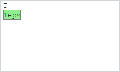
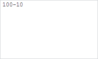

# TermEdit.addACTerms

TermEdit.addACTerms
-

# TermEdit.addACTerms

## Синтаксис

addACTerms(data: [PP.Ufe.Ui.Term](../Term/Term.htm)
 || Array);

## Параметры

data.
 Терм или массив термов, описанных в виде объекта, строки или объекта класса
 [PP.Ufe.Ui.Term](../Term/Term.htm).

## Описание

Метод addACTerms добавляет терм-подсказку
 в редактор термов.

## Пример

Для выполнения примера предполагается наличие на странице компонента
 [TermEdit](TermEdit.htm) с наименованием «termEdit» (см. «[Пример создания
 компонента TermEdit](../../../Components/TermEdit/Example_TermEdit.htm)»). Добавим терм-подсказку с содержимым «Терм»
 и установим ему новый стиль, также добавим игнорируемый терм с содержимым
 «-»:

// Добавляем терм-подсказку
acTerm = new PP.Ufe.Ui.Term({
    Content: "Терм",
});
acTerm.setDomNode(PP.htmlToDOM("
Терм
"));
termEdit.addACTerms(acTerm);
// Добавляем новый игнорируемый терм
termEdit.getIgnoreTerms().push("-");
// Создаем новый стиль
var style = new PP.Style({
    // Устанавливаем фоновый цвет окна подсказок
    Background: new PP.SolidColorBrush({
        Color: PP.Color.Colors.lightgreen
    })
});
// Устанавливаем стиль подсказкам
termEdit.setACStyle(style);
Вводим символ «Т» в окно редактора термов. В результате будет выведена
 подсказка для автодополнения терма:

Добавим в редактор следующее выражение: «100-10»:

 Получаем длину всего выражения и конечную формулу:

//Получаем длину выражения
console.log("Длина всего выражения: " + termEdit.getLength());
// Получаем результирующую формулу
console.log("Формула: " + termEdit.getFormula());
В результате в консоль будет выведены длина выражения и конечная формула:

Длина всего выражения: 6

Формула: 10010

В конечной формуле будет отсутствовать символ «-», так как он был добавлен
 в игнорируемые термы.

См. также:

[TermEdit](TermEdit.htm)

		Справочная
		 система на версию 10.9
		 от 18/08/2025,
		 © ООО «ФОРСАЙТ»,
