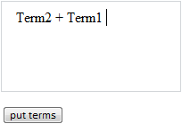

# TermEdit.putCustom

TermEdit.putCustom
-

# TermEdit.putCustom

## Синтаксис

putCustom(text, formula, position);

## Параметры

text. Текст пользовательского
 терма, который будет помещаться в коллекцию;

formula. Формула
 пользовательского терма;

position. Необязательный
 параметр, определяющий позицию, в которую будет помещаться пользовательский
 терм.

## Описание

Метод putCustom добавляет пользовательский
 терм в редактор термов.

## Пример

Для выполнения примера на html-странице в теге HEAD добавьте ссылки
 на библиотеку компонентов PP.js и визуальные стили PP.css и TermEdit.css.
 Создадим компонент [TermEdit](TermEdit.htm) и добавим кнопку,
 при нажатии на которую будет выполняться функция putTerms():

<body>

<!--Редактор термов-->

 

<!--Кнопка-->

<input type="button" value="put
 terms" onclick="putTerms();" style="vertical-align:
 top;" />

</body>

После выполнения примера на html-странице будет размещен редактор термов
 и кнопка с надписью «put terms», при нажатии на которую в список термов
 будут добавлены терм с текстом «Term1», пользовательский терм «+» и литеральный
 терм «Term2»:

См. также:

[TermEdit](TermEdit.htm)

		Справочная
		 система на версию 10.9
		 от 18/08/2025,
		 © ООО «ФОРСАЙТ»,
