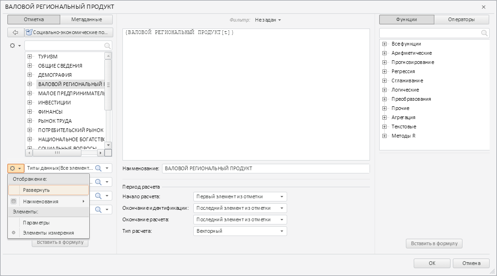
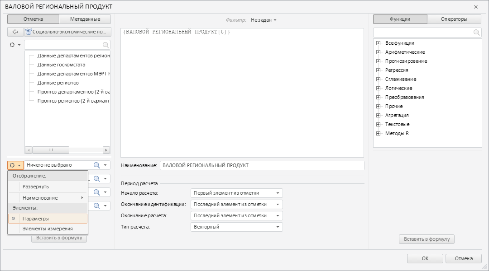

# TransformDialogDimPanel.DimensionExpanded

TransformDialogDimPanel.DimensionExpanded
-

# TransformDialogDimPanel.DimensionExpanded

## Синтаксис

DimensionExpanded: function(sender, args);

## Параметры

sender. Источник события;

args. Информация
 о событии. Аргументы: DimIndex
 - индекс открытого измерения.

## Описание

Событие DimensionExpanded наступает
 после раскрытия панели с помощью пункта контекстного меню.

## Пример

Для выполнения примера необходимо наличие на html-странице компонента
 [TransformDialog](../../../Components/TransformDialog/TransformDialog.htm)
 с наименованием «dialog» (см. «[Пример
 создания компонента TransformDialog](../../../Components/TransformDialog/Example_TransformDialog.htm)»). Добавим к первой раскрывающейся
 панели левой колонки окна обработчики событий DimensionExpanded
 и DimensionModeChanged:

// Получаем первую раскрывающуюся панель
PP.Object.defineProps(PP.Ufe.Ui.TransformDialog, 'LeftPanel', true);
PP.Object.defineProps(PP.Ufe.Ui.TransformDialogLeftPanel, 'collapsedPanels', true);
var collapsedPanel = dialog.getLeftPanel().getcollapsedPanels()[0];
// Устанавливаем обработчик события раскрытия панели
collapsedPanel.DimensionExpanded.add(function(sender, args){
    console.log("Панель раскрыта с помощью пункта контекстного меню");
});
// Устанавливаем обработчик события изменения режима отображения элементов дерева панели
collapsedPanel.DimensionModeChanged.add(function(sender, args){
    console.log("Изменился режим отображения элементов дерева панели");
});
Раскроем панель с помощью пункта контекстного меню, которое расположено
 слева от панели:

В результате раскрывающаяся панель была раскрыта, а в консоль было выведено
 следующее сообщение:

Панель раскрыта с помощью пункта контекстного меню

Изменим режим отображения элементов на отображение параметров:

В консоль было выведено сообщение об изменении режима отображения элементов
 дерева:

Изменился режим отображения элементов дерева панели

См. также:

[TransformDialogDimPanel](TransformDialogDimPanel.htm)

		Справочная
		 система на версию 10.9
		 от 18/08/2025,
		 © ООО «ФОРСАЙТ»,
