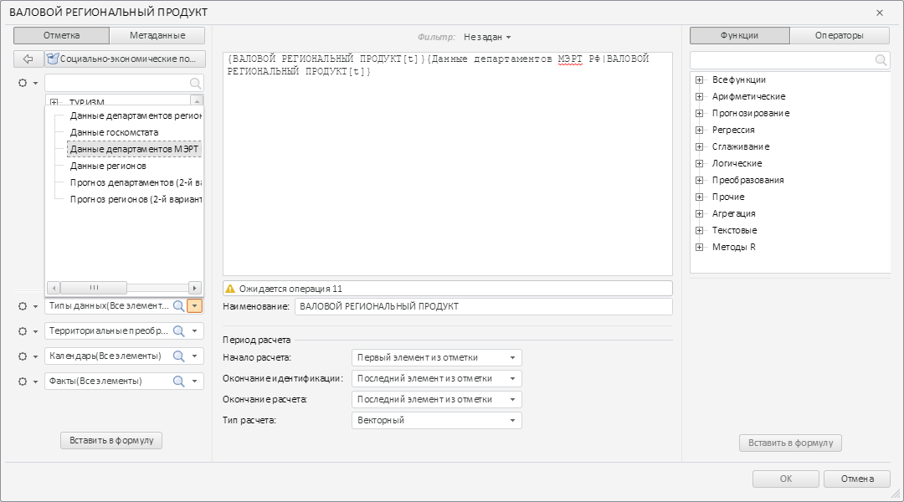

# TransformDialogDimPanel.getExpression

TransformDialogDimPanel.getExpression
-

# TransformDialogDimPanel.getExpression

## Синтаксис

getExpression();

## Описание

Метод getExpression возвращает
 объект с данными о выбранном элементе.

## Комментарии

Возвращаемое значение содержит следующие поля:

- n. Идентификатор измерения;

- v. Индекс выбранного элемента
 измерения.

## Пример

Для выполнения примера необходимо наличие на html-странице компонента
 [TransformDialog](../../../Components/TransformDialog/TransformDialog.htm)
 с наименованием «dialog» (см. «[Пример
 создания компонента TransformDialog](../../../Components/TransformDialog/Example_TransformDialog.htm)»). Добавим к первой раскрывающейся
 панели левой колонки окна обработчики следующих событий: [TreeDblClick](TransformDialogDimPanel.TreeDblClick.htm),
 [TreeDragStart](TransformDialogDimPanel.TreeDragStart.htm),
 [TreeSelectionChanged](TransformDialogDimPanel.TreeSelectionChanged.htm):

// Получаем первую раскрывающуюся панель
PP.Object.defineProps(PP.Ufe.Ui.TransformDialog, 'LeftPanel', true);
PP.Object.defineProps(PP.Ufe.Ui.TransformDialogLeftPanel, 'collapsedPanels', true);
var collapsedPanel = dialog.getLeftPanel().getcollapsedPanels()[0];
// Устанавливаем обработчик события двойного нажатия на элемент дерева панели
collapsedPanel.TreeDblClick.add(function(sender, args){
    console.log("Произошло двойное нажатие на элемент дерева");
    console.log("Идентификатор выбранного измерения: " + collapsedPanel.getExpression().n);
    console.log("Иднекс выбранного элемента измерения: " + collapsedPanel.getExpression().v);
});
// Устанавливаем обработчик события изменения отметки элементов дерева
collapsedPanel.TreeSelectionChanged.add(function(sender, args){
    console.log("Изменилась отметка элементов дерева");
});
// Устанавливаем обработчик начала перетаскивания элемента дерева
collapsedPanel.TreeDragStart.add(function(sender, args){
    console.log("Началось перетаскивание элемента дерева");
});
Откроем первую раскрывающуюся панель левой колонки окна
 и дважды щелкнем по третьему элементу. В результате в редактор выражений
 будет добавлен новый элемент:

 

В консоль были выведены следующие сообщения:

Изменилась отметка элементов дерева

Произошло двойное нажатие на элемент дерева

Идентификатор выбранного измерения: D_SRC

Индекс выбранного элемента измерения: 2

После начала перетаскивания элемента дерева в консоль будет выведено
 следующее сообщение:

Началось перетаскивание элемента дерева

См. также:

[TransformDialogDimPanel](TransformDialogDimPanel.htm)

		Справочная
		 система на версию 10.9
		 от 18/08/2025,
		 © ООО «ФОРСАЙТ»,
