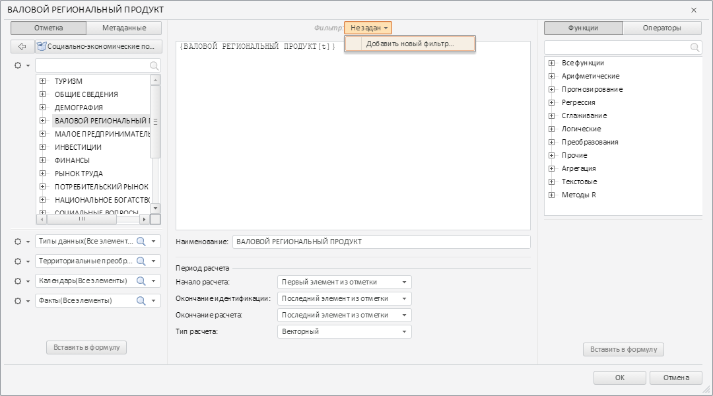
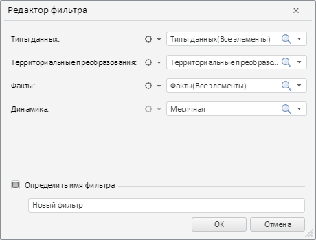

# TransformFilterDialog.getFilterName

TransformFilterDialog.getFilterName
-

# TransformFilterDialog.getFilterName

## Синтаксис

getFilterName();

## Описание

Метод getFilterName возвращает
 наименование редактируемого фильтра.

## Пример

Для выполнения примера необходимо наличие на html-странице компонента
 [TransformDialog](../../../Components/TransformDialog/TransformDialog.htm)
 с наименованием «dialog» (см. «[Пример
 создания компонента TransformDialog](../../../Components/TransformDialog/Example_TransformDialog.htm)»). Вызовем окно редактирования
 фильтра нажатием на пункт «Добавить новый фильтр...» контекстного меню
 поля фильтра редактора выражений:

В результате было открыто окно редактирования фильтра. Отметим
 флажок с наименованием «Определить имя фильтра» и введём наименование
 фильтра:

Добавим к окну редактирования фильтра обработчик события
 нажатия на кнопку закрытия и получим наименование фильтра и значение динамики
 фильтра:

// Получаем окно редактирования фильтра
PP.Object.defineProps(PP.Ufe.Ui.TransformDialog, 'filterDialog', true);
var filterDialog = dialog.getfilterDialog();
// Устанавливаем обработчик события нажатия на кнопку закрытия
filterDialog.CloseButtonClicked.add(function(sender, args){
    console.log("окно редактирования фильтра было закрыто");
});
// Получаем наименование фильтра
console.log("Наименование фильтра: " + filterDialog.getFilterName());
// Получаем значение динамики фильтра
console.log("Значение динамики фильтра: " + filterDialog.getDynamicValue());
В результате в консоль были выведены наименование фильтра и значение
 динамики фильтра:

Наименование фильтра: Новый фильтр

Значение динамики фильтра: Month

После закрытия окна редактирования фильтра в консоль будет
 выведено следующее сообщение:

окно редактирования фильтра было закрыто

См. также:

[TransformFilterDialog](TransformFilterDialog.htm)

		Справочная
		 система на версию 10.9
		 от 18/08/2025,
		 © ООО «ФОРСАЙТ»,
