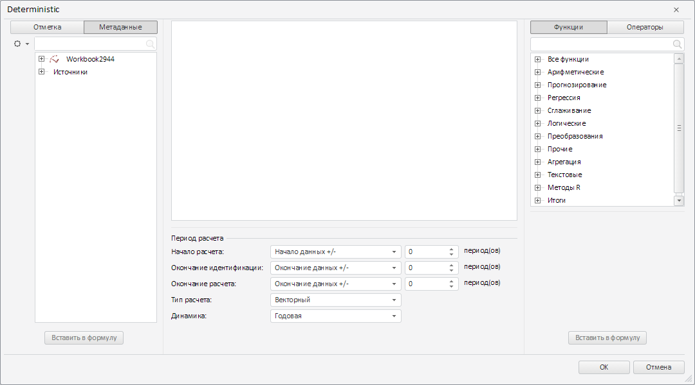

# Конструктор WbkTransformDialog

Конструктор WbkTransformDialog
-

# Конструктор WbkTransformDialog

## Синтаксис

PP.Ufe.Ui.WbkTransformDialog(settings);

## Параметры

settings. JSON-объект со значениями
 свойств класса.

## Описание

Конструктор WbkTransformDialog создает
 экземпляр класса WbkTransformDialog.

## Пример

Для выполнения примера необходимо наличие на html-странице компонента
 [WorkbookBox](dhtmlTS.chm::/Components/TimeSeries/WorkbookBox/WorkbookBox.htm)
 с наименованием «workbookBox» (см. «[Пример
 создания компонента WorkbookBox](dhtmlTS.chm::/Components/TimeSeries/WorkbookBox/Component_WorkbookBox.htm)»). Создадим и отобразим
 диалог для редактирования формулы элемента измерения рабочей книги:

function prepareDialog() {
    // Подгружаем сценарии и стили для редактора формулы
    PP.resourceManager.addToResourceList(["Ufe"], true);
    var sp = PP.CSSPath;
    PP.scriptManager.loadStyles([sp + "PP.Ufe.css"]);
    sp = PP.ScriptPath;
    PP.ScriptManager.loadScripts([sp + "PP.Ufe.js"], PP.Delegate(this.createDialog, null));
}
// Создаём редактор выражения для рабочей книги
function createWbkTransformDialog() {
    // Создаём диалог для создания и редактирования формулы элемента измерения рабочей книги
    var dialog = new PP.Ufe.Ui.WbkTransformDialog({
        Data: PP.TS.Ui.FormulaTypeEnum.Calculator,
        // Устанавливаем соединение с репозиторием
        Metabase: metabase,
        // Устанавливаем источник данных
        WbkSource: source,
        Series: source.getSelectedSeries(),
        Mode: PP.TS.CalculatorMode.Add
    });
    // Устанавливаем ряд данных
    dialog._Series = source.getSelectedSeries();
    return dialog;
}
function createDialog() {
    var dialog = createWbkTransformDialog();
    // Отображаем диалог
    dialog.show();
    // Обрабатываем событие MetadataChanged
    workbookBox.MetadataChanged.add(function(sender, args) {
        if (args.getPropertyName() == "Formulas") {
           // Устанавливаем ряд данных по умолчанию
           dialog.onTempSerieCreated(args);
        }
    });
    // Обрабатываем событие CreateTempSerie
    dialog.CreateTempSerie.add(function(sender, args) {
        // Получаем вкладку «Вычисления» ленты инструментов рабочей книги
        var formulasCategory = workbookBox.getRibbonView().getFormulasCategory();
        var dlgRes = args.DialogResult;
        var metaSettings = dlgRes || {};
        metaSettings.formulaType = dialog.getData();
        formulasCategory._launchSerieProcessing(metaSettings, dialog.getTag(), true);
    });
    // Обрабатываем событие ApplyFormula
    dialog.ApplyFormula.add(function(sender, args) {
       console.log("Формула успешно применена");
    });
}
// Подгружаем необходимые сценарии и стили для создания редактора формул в рабочей книге
prepareDialog();
В результате выполнения примера был создан и отображён диалог для редактирования
 формулы элемента измерения рабочей книги:

Выберем в данном окне любой ряд данных и нажмём на кнопку
 «OK». После этого диалог закроется, а в консоли браузера будет выведено
 уведомление о том, что формула успешно применена.

См. также:

[WbkTransformDialog](WbkTransformDialog.htm)

		Справочная
		 система на версию 10.9
		 от 18/08/2025,
		 © ООО «ФОРСАЙТ»,
