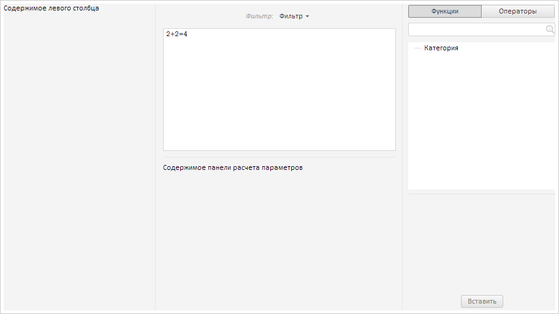

# Пример создания компонента FormulaEditor

Пример создания компонента FormulaEditor
-

# Пример создания компонента FormulaEditor

Для выполнения примера необходимо создать html-страницу и выполнить
 следующие действия:

1. Добавить ссылки на файлы стилей PP.css, PP.Metabase.css, PP.Ufe.css.

Также нужно добавить ссылки на файлы сценариев PP.js, PP.Metabase.js,
 PP.Ufe.js, resources.ru.js.

2. Добавить сценарий, создающий компонент [FormulaEditor](FormulaEditor.htm):

PP.ImagePath = "../../../../../build/img/"; // Путь к папке с изображениями
PP.ScriptPath = "../../../../../build/"; // Путь к папке со сценариями
PP.CSSPath = "../../../../../build/"; // Путь к папке с файлами стилей
// Устанавливаем путь к корневой папке, содержащей файлы ресурсов
PP.resourceManager.setRootResourcesFolder("../../../../../resources/");
// Устанавливаем языковые настройки для ресурсов
PP.setCurrentCulture(PP.Cultures.ru);
function createFormulaEditor() {
    // Создам редактор выражения
    formulaEditor = new PP.Ufe.Ui.FormulaEditor({
        // Устанавливаем родительский элемент
        ParentNode: document.getElementById("formulaEditor"),
        // Исходные категории формул, устанавливаемые при инициализации редактора
        InitialFunctionCategories: [{
            Key: "key0",
            Text: "Категория"
        }],
        // Исходные термы, устанавливаемые при инициализации
        InitialTerms: ["2+2=4"],
        // Устанавливаем содержимое левого столбца
        LeftColumnContent: "Содержимое левого столбца",
        // Устанавливаем минимальную ширину центрального столбца
        MinCenterColumnWidth: 50,
        // Устанавливаем содержимое панели расчета параметров
        CalculationPanelContent: " Содержимое панели расчета параметров",
        // Устанавливаем шаблон описания операторов и функций
        DescriptionTemplate: '
Вид: {entity}

Описание: {description}
'
    });
    // Устанавливаем новое название кнопке фильтрации
    formulaEditor.getFilterMenuButton().setContent("Фильтр");
    // Устанавливаем фокус на редактор термов
    formulaEditor.setFocusTermEdit();
}
4. В теге <body> в качестве значения атрибута «onLoad» указать
 наименование функции createFormulaEditor().

В результате выполнения примера на страницу будет добавлен редактор
 выражения:

См. также:

[FormulaEditor](FormulaEditor.htm)

		Справочная
		 система на версию 10.9
		 от 18/08/2025,
		 © ООО «ФОРСАЙТ»,
