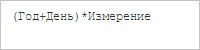
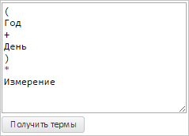

# Пример создания компонента TermEdit

Пример создания компонента TermEdit
-

# Пример создания компонента TermEdit

Для выполнения примера необходимо создать html-страницу и выполнить
 следующие действия:

1. Добавить ссылки на файлы стилей PP.css, PP.Metabase.css, PP.Ufe.css.

Также нужно добавить ссылки на файлы сценариев PP.js, PP.Metabase.js,
 PP.Ufe.js.

2. В теге <body> добавить два элемента 
 с идентификаторами «TE»
 (контейнер для редактора выражений) и «get_terms_btn» (контейнер для кнопки), элемент
 <textArea> (текстовое поле, в которое выводится результат выполнения
 функции get_terms):

<!-- Редактор выражений -->

 
<!-- Текстовое поле -->
<textarea id="res" cols="30" rows="9"></textarea>
 
<!-- Кнопка -->

3. Далее в теге <body> добавить скрипт, создающий компонент [TermEdit](TermEdit.htm):

// Создаем компонент TermEdit
var termEdit = new PP.Ufe.Ui.TermEdit({
    ParentNode: "TE",
    Width: 200,
    Height: 100,
    // Список термов
    Terms: [{  // Текст терма
        Content: "(",
          // Формула терма
         Formula: "(",
    }, {
        Content: "Год",
         Formula: "Year",
    }, {
        Content: "+",
         Formula: "+",
    }, {
        Content: "День",
         Formula: "Day",
    }, {
        Content: ")",
         Formula: ")",
    }, {
        Content: "*",
         Formula: "*",
    }, {
        Content: "Измерение",
         Formula: "Dimension",
    }]
});
// Создаем функцию, которая размещает термы в текстовом поле
function get_terms() {
    var terms = termEdit.getTerms(); //возвращаем список термов
    var resArea = document.getElementById("res"); //текстовое поле
    resArea.value = "";
    for (var i = 0; i < terms.length; i++)  {
        // Значение текстового поля
        resArea.value += terms[i] + "\n"; //
    }
}
// Создаем кнопку, при нажатии на которую выполняется функция get_terms
var get_terms_btn = new PP.Ui.Button({
    Content: "Получить термы",
    ParentNode: document.getElementById("get_terms_btn"),
    Click: get_terms
});

После выполнения примера на html-странице будет размещен компонент [TermEdit](TermEdit.htm), имеющий следующий вид:

Ниже будет размещаться текстовое поле, которое будет заполнено списком
 термов после нажатия на кнопку «Получить термы»:

См. также:

[TermEdit](../../Classes/PP_Ufe_Ui/TermEdit/TermEdit.htm)

		Справочная
		 система на версию 10.9
		 от 18/08/2025,
		 © ООО «ФОРСАЙТ»,
