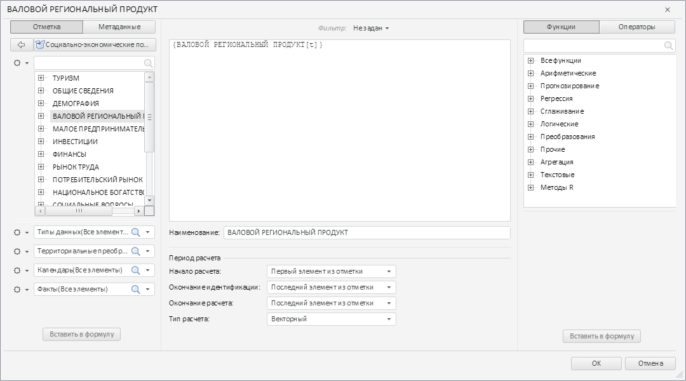

# Пример создания компонента TransformDialog

Пример создания компонента TransformDialog
-

# Пример создания компонента TransformDialog

Для выполнения примера необходимо создать html-страницу и выполнить
 следующие действия:

1. Добавить ссылки на файлы стилей PP.css, PP.Express.css, PP.Metabase.css,
 PP.Ufe.css.

Также нужно добавить ссылки на файлы сценариев PP.js, PP.Metabase.js,
 PP.Express.js, PP.Ufe.js, resources.ru.js.

2. Для выполнения примера в репозитории должен существовать экспресс-отчёт
 с ключом 10902. Допускается указание в примере ключа другого существующего
 экспресс-отчёта.

Также вместо ключа измерения 104 и ключа элемента 20000 можно указать
 собственные значения.

3. Добавить сценарий, создающий экспресс-отчёт и диалог для редактирования
 формулы элемента измерения экспресс-отчёта [TransformDialog](TransformDialog.htm):

PP.ImagePath = "../build/img/"; // Путь к папке с изображениями
PP.ScriptPath = "../build/"; // Путь к папке со сценариями
PP.CSSPath = "../build/"; // Путь к папке с файлами стилей
function createTransformer() {
    // Устанавливаем путь к корневой папке, содержащей файлы ресурсов
    PP.resourceManager.setRootResourcesFolder("../build/resources/");
    // Устанавливаем языковые настройки для ресурсов
    PP.setCurrentCulture(PP.Cultures.ru);
    // Создаём соединение с репозиторием
    mb = new PP.Mb.Metabase({
        PPServiceUrl: "PPService.axd?action=proxy",
        Id: "WAREHOUSE",
        UserCreds: {
            UserName: "user",
            Password: "password"
        }
    });
    // Открываем соединение с репозиторием
    mb.open();
    // Создаём сервис для работы с экспресс-отчётами
    eaxMdService = new PP.Exp.EaxMdService({
        Metabase: mb
    });
    eaxMdService.setMetaGet(eaxMdService.getDefaultMetaGet());
    // Открываем документ с ключом 10902
    eaxDocument = eaxMdService.editDocument(10902);
    // Создаем контейнер для экспресс-отчетов
    expressBox = new PP.Exp.Ui.ExpressBox({
        // Устанавливаем родительский элемент
        ParentNode: document.body,
        // Устанавливаем источник
        Source: eaxDocument,
        // Устанавливаем сервис
        Service: eaxMdService
    });
    // Изменяем размеры контейнера ExpressBox
    window.onresize();
    setTimeout(preloadDialog, 3000);
}
function preloadDialog() {
    // Выбираем вкладку «Отметка» на левой панели
    expressBox.getSlidePanelViewToolBar().getItem(1).setIsChecked(true);
    // Раскрываем панель с наименованием «Социально-экономические показатели»
    expressBox.getSlidePanelView().getDetailsContent().getControl().getItems()[9].expand();
    setTimeout(loadDialog, 1000);
}
function loadDialog() {
    // Создаем диалог для задания и изменения формулы элемента измерения экспресс-отчета
    dialog = new PP.Ufe.Ui.TransformDialog({
        // Устанавливаем соединение с репозиторием
        Metabase: mb,
        // Устанавливаем источник данных
        EaxSource: expressBox.getSource(),
        // Устанавливаем данные элемента, который будет загружен при отображении диалога
        CurDimElementData: eaxDocument.getDims()[1].getElem("20000"),
        // Устанавливаем ключ измерения, из которого извлекаются данные
        EaxDimKey: 104,
    });
    // Отображаем диалог
    dialog.showDialog();
}
var idTime;
// Функция для изменения размеров контейнера ExpressBox при изменении размеров страницы
window.onresize = function updateSize() {
    if (idTime)
        clearTimeout(idTime);
    idTime = setTimeout(function() {
        if (expressBox) {
            expressBox.setWidth(document.body.offsetWidth - 5);
            expressBox.setHeight(document.body.offsetHeight - 5);
        }
        idTime = null;
    }, 100);
};
4. В теге <body> в качестве значения атрибута «onLoad» указать
 наименование функции createTransformer().

В результате выполнения примера был создан диалог для создания и редактирования
 формулы элемента измерения экспресс-отчёта:

См. также:

[TransformDialog](TransformDialog.htm)

		Справочная
		 система на версию 10.9
		 от 18/08/2025,
		 © ООО «ФОРСАЙТ»,
