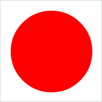

# Animation.animateSVGAttr

Animation.animateSVGAttr
-

**

# Animation.animateSVGAttr

## Синтаксис

animateSVGAttr(context: SVGElement, propertyName: String, callback: PP.Delegate|function);

## Параметры

context. SVG-элемент, у которой анимируется свойство;

propertyName. Наименование анимируемого свойства;

callback. Возвратная функция.

## Описание

Метод animateSVGAttr** воспроизводит анимацию атрибута SVG-элемента с текущими параметрами.

## Пример

Для выполнения примера необходимо наличие на странице экземпляра класса [Animation](Animation.htm) с наименованием «animation» (см. «[Конструктор Animation](Constructor_Animation.htm)»). Создадим и разместим в текстовой области SVG-элемент, содержащий круг со сплошной заливкой красного цвета:

// Создадим текстовую область
var textArea = new PP.Ui.TextArea();
// Добавим данную область в документ
textArea.addToNode(document.body);
// Создадим анимацию
var animation = new PP.Ui.Animation({
        Context: textArea, // Объект, свойство которого будет меняться
        PropertyName: "Style",
        Duration: 2000, // Длительность анимации в миллисекундах
        Start: 10, // Начальный шаг анимации
        End: 80 // Последний шаг анимации
    });
// Получим DOM-вершину текстовой области
var domNode = textArea.getDomNode();
// Создадим SVG-элемент, содержащий красный круг
var svg = document.createElementNS("http://www.w3.org/2000/svg", "svg");
var circle = document.createElementNS("http://www.w3.org/2000/svg", "circle");
circle.setAttribute("cx", "100");
circle.setAttribute("cy", "100");
circle.setAttribute("r", "40");
circle.setAttribute("fill", "red");
svg.appendChild(circle);
// Разместим в текстовой области красный круг
domNode.appendChild(svg);
// Изменим ширину и высоту текстовой области
textArea.setStyle("width: 200px; height: 200px");

В результате выполнения примера был создан и размещён в текстовой области SVG-элемент, содержащий круг со сплошной заливкой красного цвета с радиусом, равным 40 пикселям, и с отступами от верхнего левого края, равными 100 пикселям:

Далее воспроизведём анимацию изменения радиуса данного круга от 10 до 80 пикселей в течение двух секунд:

animation.animateSVGAttr(svg.childNodes[0], "r");

В результате выполнения примера в течение двух секунд была воспроизведена анимация изменения радиуса круга от 10 до 80 пикселей. После анимации круг стал выглядеть следующим образом:

См. также:

[Animation](Animation.htm)

		Справочная
		 система на версию 10.9
		 от 18/08/2025,
		 © ООО «ФОРСАЙТ»,
