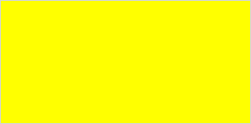

# Конструктор AnimationPoint

Конструктор AnimationPoint
-

**

# Конструктор AnimationPoint

## Синтаксис

PP.Ui.AnimationPoint(settings: Object);

## Параметры

settings. JSON-объект со значениями
 свойств класса.

## Описание

Конструктор AnimationPoint** создаёт экземпляр класса [AnimationPoint](AnimationPoint.htm).

## Пример

Для выполнения примера необходимо наличие на html-странице ссылок на
 файл сценария PP.js и файл стилей PP.css, а сам пример нужно запустить
 в консоли браузера. Создадим текстовую область и добавим её на страницу:

// Создадим текстовую область
var textArea = new PP.Ui.TextArea({
    Width: 200, // Ширина
    Height: 100 // Высота
});
// Добавим данную область в документ
textArea.addToNode(document.body);

В результате выполнения примера на страницу была добавлена текстовая
 область:

Затем создадим объект анимации, реализующий плавное изменение размеров
 данной области. По окончании воспроизведения окрасим текстовую область
 в жёлтый цвет и рассчитаем длительность анимации:

// Получим DOM-вершину текстовой области
var domNode = textArea.getDomNode();
var startTime = 0; // Переменная для хранения длительность анимации
// Создадим точку анимации
var animationPoint = new PP.Ui.AnimationPoint({
    /* Воспроизводить анимацию будем
	через 2 секунды после её запуска */
    Value: 2000,
    // Укажем массив анимаций
    Items: [new PP.Ui.Animation({
            Context: domNode,
            PropertyName: "width",
            AnimationType: PP.Ui.AnimationType.CSS,
            Start: 50, // Минимальная ширина - 50 пикселей
            End: 300, // Максимальная ширина - 300 пикселей
            Duration: 2000 // Длительность анимации равна двум секундам
        }), new PP.Ui.Animation({
            Context: domNode,
            PropertyName: "height",
            AnimationType: PP.Ui.AnimationType.CSS,
            Start: 1, // Минимальная высота - 1 пиксель
            End: 150, // Максимальная высота - 150 пикселей
            Duration: 2000 // Длительность анимации равна двум секундам
        })]
});
// Определим возвратную функцию
var animateCallback = function (sender, args) {
    /* По завершении анимации закрасим текстовую область
	жёлтым цветом */
    args.Args.Node.style.backgroundColor = "yellow";
};
// Зададим возвратную функцию
animationPoint.setCallback(PP.Delegate(this.animateCallback, animationPoint, {
    Node: domNode
}));
// Обработаем событие Started
animationPoint.Started.add(function () {
    // Определим время начала анимации
    startTime = Date.now();
});
// Обработаем событие Ended
animationPoint.Ended.add(function () {
    // Рассчитаем реальную длительность анимации
    console.log("Длительность анимации: " + (Date.now() - startTime));
});
// Запустим воспроизведение анимации
animationPoint.run();
// Остановим анимацию через 3,5 секунды после её запуска
setTimeout("animationPoint.stop();", 3500);
В результате выполнения примера был создан объект анимации, реализующий
 плавное изменение размеров данной области. Анимация была воспроизведена
 через 2 секунды после её запуска и остановлена через 3,5 секунды. По окончании
 воспроизведения область окрасилась в жёлтый цвет:

С помощью обработки событий [Started](AnimationPoint.Started.htm)
 и [Ended](AnimationPoint.Ended.htm) была рассчитана и выведена
 в консоль браузера длительность анимации:

Длительность анимации: 1500

См. также:

[AnimationPoint](AnimationPoint.htm)

		Справочная
		 система на версию 10.9
		 от 18/08/2025,
		 © ООО «ФОРСАЙТ»,
