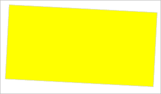

# Конструктор AnimationSequence

Конструктор AnimationSequence
-

**

# Конструктор AnimationSequence

## Синтаксис

AnimationSequence(settings: Object);

## Параметры

settings. JSON-объект со значениями
 свойств класса.

## Описание

Конструктор AnimationSequence** создаёт экземпляр класса **[AnimationSequence](AnimationSequence.htm)**.

## Пример

Для выполнения примера необходимо наличие на html-странице ссылок на
 файл сценария PP.js и файл стилей PP.css, а сам пример нужно запустить
 в консоли браузера. Создадим текстовую область и добавим её на страницу:

// Создадим текстовую область
var textArea = new PP.Ui.TextArea({
    Width: 200, // Ширина
    Height: 100 // Высота
});
// Добавим данную область в документ
textArea.addToNode(document.body);

В результате выполнения примера на страницу была добавлена текстовая
 область:

Затем создадим объект последовательности анимаций, реализующий плавное
 изменение размеров данной области и её поворот. По окончании воспроизведения
 окрасим текстовую область в жёлтый цвет, рассчитаем длительность анимации
 в целом и длительность каждого её шага:

// Определим переменную для хранения длительности анимации
var startTime = 0;
// Получим DOM-вершину текстовой области
var domNode = textArea.getDomNode();
// Создадим 3 элемента анимации
var item1 = new PP.Ui.Animation({
    Context: domNode,
    PropertyName: "width", // изменяемый параметр (ширина)
    AnimationType: PP.Ui.AnimationType.CSS,
    Start: 0, // начальное значение изменяемого параметра
    End: 300, // конечное значение изменяемого параметра
    Duration: 1000 // длительность анимации
})
var item2 = new PP.Ui.Animation({
    Context: domNode,
    PropertyName: "height", // изменяемый параметр (высота)
    AnimationType: PP.Ui.AnimationType.CSS,
    Start: 1, // начальное значение изменяемого параметра
    End: 150, // конечное значение изменяемого параметра
    Duration: 1000 // длительность анимации
})
var item3 = new PP.Ui.Animation({
    Context: textArea,
    PropertyName: 'Rotate', // изменяемый параметр (угол поворота)
    AnimationType: PP.Ui.AnimationType.PPProp,
    Start: 0, // начальное значение изменяемого параметра
    End: 3, // конечное значение изменяемого параметра
    Duration: 500 // длительность анимации
})
// Создадим последовательность анимаций
var as = new PP.Ui.AnimationSequence({
    Items: [
        [item1, item2],
        [item3]
    ]
})
// Обработаем событие Started
as.Started.add(function () {
    // Определим время начала анимации
    startTime = Date.now();
    // Выведем сообщение о начале анимации
    console.log("Анимация началась")
});
// Обработаем событие Step
as.Step.add(function () {
    // Рассчитаем длительность шага анимации
    console.log("Шаг анимации закончился, длительность шага: " + (Date.now() - startTime));
});
// Обработаем событие Ended
as.Ended.add(function () {
    // Рассчитаем реальную длительность анимации
    console.log("Анимация закончилась, длительность анимации: " + (Date.now() - startTime));
});
// Определим возвратную функцию
var animateCallback = function (sender, args) {
    /* По завершении анимации закрасим текстовую область
	жёлтым цветом */
    args.Args.Node.style.backgroundColor = "yellow";
};
// Зададим возвратную функцию
as.setCallback(PP.Delegate(this.animateCallback, as, {
    Node: domNode
}));
// Запустим воспроизведение анимации
as.run();
// Остановим анимацию через 3,5 секунды после её запуска
setTimeout("as.stop();", 3500);
В результате выполнения примера был создан объект последовательности
 анимаций, реализующий плавное изменение размеров текстовой области и её
 поворот. Анимация была остановлена через 3,5 секунды после начала воспроизведения.
 По окончании воспроизведения область окрасилась в жёлтый цвет:

С помощью обработки событий [Started](../AnimationPoints/AnimationPoints.Started.htm),
 [Ended](../AnimationPoints/AnimationPoints.Ended.htm) и [Step](../AnimationPoints/AnimationPoints.Step.htm) была рассчитана
 и выведена в консоль браузера длительность анимации в целом и длительность
 каждого её шага:

Анимация началась

Шаг анимации закончился, длительность шага: 3

Шаг анимации закончился, длительность шага: 1008

Анимация закончилась, длительность анимации: 1508

См. также:

[AnimationSequence](AnimationSequence.htm)

		Справочная
		 система на версию 10.9
		 от 18/08/2025,
		 © ООО «ФОРСАЙТ»,
