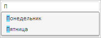
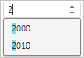

# Конструктор Autocomplete

Конструктор Autocomplete
-

# Конструктор Autocomplete

## Синтаксис

PP.Ui.Autocomplete(settings: Object)

## Параметры

settings. JSON-объект со значениями
 свойств компонента.

## Описание

Конструктор Autocomplete создает
 экземпляр компонента Autocomplete.

## Пример

Для выполнения примера в теге HEAD добавьте ссылки на библиотеку компонентов
 PP.js, визуальные стили PP.css и файл с ресурсами (например, resources.ru.js).

В теге HEAD добавьте стиль, переопределяющий цвет подсветки совпадающих
 символов в подсказке для автозавершения ввода текста

В теге BODY добавьте элементы DIV с идентификаторами «example» и «example1».
 В теге SCRIPT добавьте следующий код:

var autocomplete = new PP.Ui.Autocomplete({
    // Массив элементов управления, для которых будет применяться автозавершение
    Targets: [{
        // Создаём текстовую строку
        Control: textBox = new PP.Ui.TextBox({
            ParentNode: document.getElementById("example"),
            Width: 200,
            Id: "TB1"
        }),
        AlwaysShow: true,
        Active: true,
        MatchCase: true, // Автозавершение выполняем с учётом регистра
        // Определяем возможные варианты для автозавершения ввода текста
        Suggestions: [{
            Text: "Понедельник"
        }, {
            Text: "Вторник"
        }, {
            Text: "Среда"
        }, {
            Text: "Четверг"
        }, {
            Text: "Пятница"
        }, {
            Text: "Суббота"
        }, {
            Text: "Воскресенье"
        }]
    }, {
        // Создаём числовой редактор
        Control: number = new PP.Ui.NumberEdit({
            ParentNode: document.getElementById("example1"),
            Width: 100,
            Id: "NE1"
        }),
        AlwaysShow: true,
        Active: true,
        MatchCase: false, // Автозавершение выполняем без учёта регистра
        // Определяем возможные варианты для автозавершения
        Suggestions: [{
            Text: "1990"
        }, {
            Text: "2000"
        }, {
            Text: "2010"
        }, ]
    }]
});
/* Устанавливаем минимальное количество символов,
при котором вызывается подсказка для автозавершения */
autocomplete.setMinAutoFindSymbolsCount(1);
/* Разрешаем подсветку совпадающих символов в подсказке
для автозавершения ввода текста */
autocomplete.setEnableHighlight(true);
// Обрабатываем событие выбора варианта автозаполнения из списка при помощи клавиш UP/DOWN
autocomplete.SelectionChanged.add(function () {
    alert("SelectionChanged")
});
После выполнения примера на странице будут размещены компоненты [TextBox](../../Components/TextBox/TextBox.htm)
 и [NumberEdit](../../Components/NumberEdit/NumberEdit.htm),
 для каждого из которых будет настроено автозавершение. При вводе первого
 символа будет открываться список с возможными вариантами завершения, а
 сам символ будет подсвечен:

Текстовый редактор:

Числовой редактор:

При выборе вариантов автозаполнения при помощи клавиш UP/DOWN будет
 выводиться сообщение «SelectionChanged».

[Autocomplete](Autocomplete.htm)

		Справочная
		 система на версию 10.9
		 от 18/08/2025,
		 © ООО «ФОРСАЙТ»,
