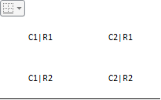
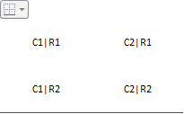
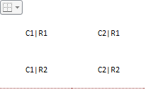
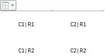

# BorderCombo.BorderTypeChanged

BorderCombo.BorderTypeChanged
-

# BorderCombo.BorderTypeChanged

## Синтаксис

BorderTypeChanged (sender, args);

## Параметры

sender. Источник события;

args. Информация
 о событии.

## Описание

Событие BorderTypeChanged наступает
 при выборе типа размещения границы.

## Пример

Для выполнения примера на html-странице должна размещаться таблица,
 состоящая из двух строк и двух столбцов, и элемент DIV с идентификатором
 «example»:

<table border="0" cellspacing="0"
 id="patient" style="border-color: '#000000'; text-align:
 center;

border-collapse: collapse">

  <tr>

    <td style="width:
 100px; height: 50px;">

       C1|R1

    </td>

    <td style="width:
 100px; height: 50px;">

       C2|R1

    </td>

  </tr>

  <tr>

    <td style="width:
 100px; height: 50px;">

       C1|R2

    </td>

    <td style="width:
 100px; height: 50px;">

       C2|R2

    </td>

  </tr>

</table>

Далее приведен javascript-код для создания компонента [BorderCombo](../../Components/BorderCombo/BorderCombo.htm)
 и его использования для настройки границ таблицы:

    

После выполнения примера на html-странице будет размещен компонент [BorderCombo](../../Components/BorderCombo/BorderCombo.htm)
 и таблица, состоящая из 2 строк и 2 столбцов. Для свойства [BorderTypeOnlt](BorderCombo.BorderTypeOnlt.htm)
 установлено значение true, поэтому
 в компоненте отображается панель для выбора типа расположения линий. Выбран
 первый тип расположения линий - граница снизу. Цвет линии по умолчанию
 - черный. Тип линии - сплошная:

При выборе цвета из раскрывающегося списка изменится цвет линии границы
 таблицы:

Из созданного компонента [BorderCombo](../../Components/BorderCombo/BorderCombo.htm)
 можно установить 2 типа линии границы таблицы: сплошную и пунктирную:

Доступны следующие типы расположения границ таблицы: граница сверху,
 граница снизу, граница отсутствует:

Изменение цвета и типа линий и расположение границ можно производить
 как при помощи свойств [BorderType](BorderCombo.BorderType.htm),
 [Color](BorderCombo.Color.htm) и [LineType](BorderCombo.LineType.htm),
 так и при выборе соответствующих пиктограмм в компоненте [BorderCombo](../../Components/BorderCombo/BorderCombo.htm).

 См. также:

[BorderCombo](BorderCombo.htm)

		Справочная
		 система на версию 10.9
		 от 18/08/2025,
		 © ООО «ФОРСАЙТ»,
