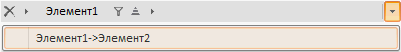

# Breadcrumb.BeforeRemoveItem

Breadcrumb.BeforeRemoveItem
-

# Breadcrumb.BeforeRemoveItem

## Синтаксис

BeforeRemoveItem: function (sender, args)

## Параметры

sender. Источник события;

args. Информация о событии.

## Описание

Событие BeforeRemoveItem наступает перед удалением элемента из компонента [Breadcrumb](../../Components/Breadcrumb/Breadcrumb.htm).

## Пример

Для выполнения примера [создайте компонент Breadcrumb](../../Components/Breadcrumb/example_Breadcrumb.htm) с [коллекцией дочерних элементов](../BreadcrumbItemsList/BreadcrumbItemsList.htm). Добавьте обработчики событий и BeforeRemoveItem и [RemoveItem](Breadcrumb.RemoveItem.htm):

       bread.BeforeRemoveItem.add(function (sender, args) {

            alert("Элемент будет удален");

        });

        bread.RemoveItem.add(function (sender, args) {

            alert("Элемент удален");

        });

После выполнения примера перед удалением элемента, то есть при нажатии на кнопку , на экран будет выведено сообщение «Элемент будет удален». Во время удаления элемента на экран выводится сообщение «Элемент удален».

События удаления элемента наступают также при добавлении элементов из истории:

См. также:

[Breadcrumb](Breadcrumb.htm)

		Справочная
		 система на версию 10.9
		 от 18/08/2025,
		 © ООО «ФОРСАЙТ»,
