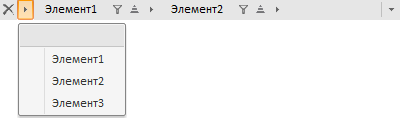

# BreadcrumbSelectedItemsList

BreadcrumbSelectedItemsList
-

# BreadcrumbSelectedItemsList

Пространство имен: PP.Ui;

## Иерархия наследования

[Object](dhtmlCommon.chm::/Classes/object/object.htm)

[List](dhtmlList.chm::/Classes/list/list.htm)

[BCList](../BCList/BCList.htm)

BreadcrumbSelectedItemsList

## Описание

Класс BreadcrumbSelectedItemsList
 реализует коллекцию элементов, выбранных в компоненте [Breadcrumb](../../Components/Breadcrumb/Breadcrumb.htm).

## Комментарии

Под элементами, выбранными в компоненте [Breadcrumb](../../Components/Breadcrumb/Breadcrumb.htm),
 понимаются элементы, отображающиеся в цепочке навигации:

«Элемент1» и «Элемент2» - экземпляры класса BreadcrumbSelectedItemsList.

Коллекция элементов компонента [Breadcrumb](../../Components/Breadcrumb/Breadcrumb.htm),
 представленная в раскрывающемся меню, реализована классом [BreadcrumbSelectedItemsList](BreadcrumbSelectedItemsList.htm).

## Синтаксис

PP.initClass(PP.Ui.BreadcrumbSelectedItemsList,
 PP.Ui.[BCList](../BCList/BCList.htm), "BreadcrumbSelectedItemsList");

## Метод, унаследованный от класса [BCList](../BCList/BCList.htm)

		 Имя метода
		 Краткое описание

		 
		 [findById](dhtmlUi.chm::/Classes/BCList/BCList.findById.htm)
		 Метод findById находит
		 элемент из коллекции по его идентификатору.

## Методы, унаследованные от класса [List](dhtmlList.chm::/Classes/list/list.htm)

		 Имя метода
		 Краткое описание

		 
		 [add](dhtmlList.chm::/classes/list/list.add.htm)
		 Метод add добавляет
		 элемент в коллекцию.

		 
		 [clear](dhtmlList.chm::/classes/list/list.clear.htm)
		 Метод clear удаляет
		 объекты из коллекции.

		 
		 [contains](dhtmlList.chm::/classes/list/list.contains.htm)
		 Метод contains определяет,
		 входит ли указанный элемент в коллекцию.

		 
		 [getCount](dhtmlList.chm::/classes/list/list.getcount.htm)
		 Метод getCount возвращает
		 количество элементов коллекции.

		 
		 [getItem](dhtmlList.chm::/classes/list/list.getitem.htm)
		 Метод getItem возвращает
		 элемент коллекции по указанному индексу.

		 
		 [indexOf](dhtmlList.chm::/classes/list/list.indexof.htm)
		 Метод indexOf возвращает
		 индекс указанного элемента коллекции.

		 
		 [insert](dhtmlList.chm::/classes/list/list.insert.htm)
		 Метод insert добавляет
		 элемент в указанную позицию.

		 
		 [insertBefore](dhtmlList.chm::/classes/list/list.insertbefore.htm)
		 Метод insertBefore
		 добавляет элемент в позицию перед указанным элементом.

		 
		 [remove](dhtmlList.chm::/classes/list/list.remove.htm)
		 Метод remove удаляет
		 указанный элемент из коллекции.

		 
		 [setItem](dhtmlList.chm::/classes/list/list.setitem.htm)
		 Метод setItem записывает
		 элемент в определенную позицию коллекции.

## События, унаследованные от класса [List](dhtmlList.chm::/Classes/list/list.htm)

		  Имя события
		 Краткое описание

		 
		 [Changed](dhtmlList.chm::/classes/list/list.changing.htm)
		 Событие Changed наступает
		 после изменения состояния коллекции.

		 
		 [Changing](dhtmlList.chm::/classes/list/list.changing.htm)
		 Событие Changing наступает
		 при изменении состояния коллекции.

## Свойства, унаследованные от класса [Object](dhtmlCommon.chm::/Classes/object/object.htm)

		 Имя свойства
		 Краткое описание

		 
		 [Id](dhtmlCommon.chm::/classes\object\object.id.htm)

		 Свойство Id определяет
		 идентификатор объекта репозитория.

## Методы, унаследованные от класса [Object](dhtmlCommon.chm::/Classes/object/object.htm)

		 Имя метода
		 Краткое описание

		 
		 [clone](dhtmlCommon.chm::/classes\object\object.clone.htm)
		 Метод clone создает
		 копию объекта.

		 
		 [dispose](dhtmlCommon.chm::/classes\object\object.dispose.htm)
		 Метод dispose уничтожает
		 компонент.

		 
		 [getHashCode](dhtmlCommon.chm::/Classes/Object/Object.getHashCode.htm)
		 Метод getHashCode возвращает
		 хеш-код объекта репозитория.

		 
		 [getId](dhtmlCommon.chm::/Classes/Object/Object.Id.htm)
		 Метод getId возвращает
		 идентификатор объекта репозитория.

		 
		 [getSettings](dhtmlCommon.chm::/Classes/Object/Object.getSettings.htm)
		 Метод getSettings возвращает
		 настройки объекта репозитория.

		 
		 [getTypeName](dhtmlCommon.chm::/classes\object\object.gettypename.htm)
		 Метод getTypeName возвращает
		 имя типа объекта без пространства имен, к которому он принадлежит.

		 
		 [isEqual](dhtmlCommon.chm::/Classes/Object/Object.isEqual.htm)
		 Метод isEqual определяет,
		 равен ли заданный объект текущему объекту репозитория.

		 
		 [isLive](dhtmlCommon.chm::/Classes/Object/Object.isLive.htm)
		 Метод isLive определяет
		 действительность объекта репозитория.

		 
		 [removeAllEvents](dhtmlCommon.chm::/Classes/Object/Object.removeAllEvents.htm)
		 Метод removeAllEvents
		 удаляет все обработчики событий объекта по заданному контексту.

		 
		 [setId](dhtmlCommon.chm::/Classes/Object/Object.Id.htm)
		 Метод setId определяет
		 идентификатор объекта репозитория.

		 
		 [setSettings](dhtmlCommon.chm::/Classes/Object/Object.setSettings.htm)
		 Метод setSettings задает
		 настройки объекта репозитория.

		 
		 [defineProps](dhtmlCommon.chm::/Classes/Object/Object.defineProps.htm)
		 Метод defineProps создает
		 методы get и set из массива имен для указанного класса.

		 
		 [keys](dhtmlCommon.chm::/Classes/Object/Object.keys.htm)
		 Метод keys возвращает
		 массив названий методов и свойств для указанного объекта.

См. также:

[Классы](../Classes.htm)

		Справочная
		 система на версию 10.9
		 от 18/08/2025,
		 © ООО «ФОРСАЙТ»,
