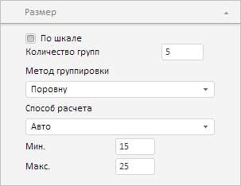

# BubbleChartMasterSize.setCurrentState

BubbleChartMasterSize.setCurrentState
-

**

# BubbleChartMasterSize.setCurrentState

## Синтаксис

setCurrentState(options);

## Параметры

*options.* Массив настроек вкладки
 «Размер» в мастере управления пузырьковой диаграммой экспресс-отчета.

## Описание

Метод setCurrentState**
 устанавливает настройки вкладки «Размер» в мастере управления пузырьковой
 диаграммой экспресс-отчета.

## Комментарии

Настройки вкладки «Размер» в мастере управления пузырьковой диаграммой
 экспресс-отчета хранятся во внутреннем свойстве _State
 класса [BubbleChartMasterSize](BubbleChartMasterSize.htm).

## Пример

Для выполнения примера необходимо наличие на html-странице компонента
 [ExpressBox](dhtmlExpress.chm::/Components/Express/ExpressBox/ExpressBox.htm)
 с наименованием «expressBox» (см. «[Пример
 создания компонента ExpressBox](dhtmlExpress.chm::/Components/Express/ExpressBox/ExpressBox_Example.htm)») и с активной вкладкой
 «Размер» в мастере управления пузырьковой диаграммой. Изменим максимальный
 и минимальный размер цветовых индикаторов:

// Получаем список панелей у мастера управления пузырьковой диаграммой экспресс-отчета
var panels = expressBox.getPropertyBarView().getBubbleChartMaster().getItems();
for (var i in panels) {
    var panel = panels[i];
    if (panel.getTypeName() == "BubbleChartMasterSize") {
        // Разворачиваем панель
        panel.expand(true);
        // Поменяем максимальный и минимальный размер цветовых индикаторов
        var state = [{
            Name: "chartmaster.sizepanel.min",
            Value: 15
        },      {
            Name: "chartmaster.sizepanel.max",
            Value: 25
        }];
        panel.setCurrentState(state);
    }
};

В результате выполнения примера был установлен минимальный и максимальный
 размер цветовых индикаторов - 15 и 25 пикселов соответственно:

См. также:

[BubbleChartMasterSize](BubbleChartMasterSize.htm)

		Справочная
		 система на версию 10.9
		 от 18/08/2025,
		 © ООО «ФОРСАЙТ»,
