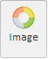

# Button.IsToggleButton

Button.IsToggleButton
-

# Button.IsToggleButton

## Синтаксис

IsToogleButton: Boolean

## Описание

Свойство IsToogleButton определяет,
 можно ли переключать состояния кнопки (нажать/отжать).

## Комментарии

По умолчанию для свойства установлено значение false,
 то есть состояние кнопки изменить нельзя. Если установлено значение true, то кнопку можно нажать/отжать.

Для примера, кнопка ленты инструментов в нажатом состоянии:

В отжатом состоянии:

## Пример

Для выполнения примера создадим [кнопку
 ленты инструментов](dhtmlRibbon.chm::/components/ribbonbutton/ribbonbutton.htm) с наименованием «Image». Для кнопки установим изображение,
 для этого предполагается наличие файла с картинками «angles.png», из которого
 будет выбираться пиктограмма. Определим, что для кнопки нельзя изменить
 состояние:

    var button = new PP.Ui.RibbonButton({
        ParentNode: document.getElementById("div2"),
        Content: "Image",
        ImageList: new PP.ImageList({ Source: "PP_img/angles.png", IconWidth: 29, IconHeight: 29 }),
        ColumnIndex: 0,
        RowIndex: 0,
        IsToggleButton: true,
        Click: function () { alert ("Click button")}
    })

После выполнения примера на странице будет размещена кнопка с наименованием
 «Image» и с изображением, выбранным из файла «angles.png»:

При нажатии на кнопку будет выдаваться сообщение «Click button», но
 кнопка не изменит вид (не будет отображаться как [нажатая](Button.IsPressed.htm)).

См. также:

[Button](Button.htm)

		Справочная
		 система на версию 10.9
		 от 18/08/2025,
		 © ООО «ФОРСАЙТ»,
