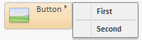

# Button.MenuArrowPosition

Button.MenuArrowPosition
-

# Button.MenuArrowPosition

## Синтаксис

MenuArrowPosition: PP.[LTRB](dhtmlCommon.chm::/enums/ltrb.htm);

## Описание

Свойство MenuArrowPosition устанавливает
 позицию стрелки дочернего меню компонента.

## Комментарии

Значения свойства - элементы перечисления [LTRB](dhtmlCommon.chm::/enums/ltrb.htm).
 По умолчанию установлено значение Bottom.

Если создается кнопка с изображением и с раскрывающимся меню, значение
 свойства [ImagePosition](Button.ImagePosition.htm)
 перекрывает значение свойства MenuArrowPosition.

## Пример

Для выполнения примера в теге <head> html-страницы добавьте ссылки
 на библиотеку PP.js и визуальные стили PP.css. Добавим на страницу кнопку
 с изображением и раскрывающимся меню:

После выполнения примера на странице будет размещена кнопка с текстом
 «Button», с изображением и раскрывающимся меню:

См. также:

[Button](Button.htm)

		Справочная
		 система на версию 10.9
		 от 18/08/2025,
		 © ООО «ФОРСАЙТ»,
