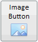

# Button.UseWrapping

Button.UseWrapping
-

# Button.UseWrapping

## Синтаксис

UseWrapping: Boolean;

## Описание

Свойство UseWrapping осуществляет перенос слов на 2 строки.

## Комментарии

Перенос осуществляется, если изображение кнопки или стрелка вызова меню расположены снизу или сверху.

При установке значения true осуществляется перенос по словам. По умолчанию установлено значение false.

## Пример

Для выполнения примера подключите к html-странице ссылки на библиотеку PP.js и таблицы визуальных стилей PP.css. Далее приведен текст javascript-кода, с помощью которого на странице размещается компонент [Button](../../Components/Button/Button.htm):

После выполнения примера на html-странице будет размещена кнопка, имеющая следующий вид:

См. также:

[Button](Button.htm)

		Справочная
		 система на версию 10.9
		 от 18/08/2025,
		 © ООО «ФОРСАЙТ»,
