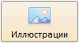

# Button.setIsHovered

Button.setIsHovered
-

# Button.setIsHovered

## Синтаксис

setIsHovered(value);

## Параметры

value. Если для параметра установлено значение true, то кнопка отображается в том виде, в каком она бывает при наведении на нее курсора. По умолчанию установлено значение false.

## Описание

Метод setIsHovered устанавливает признак того, что курсор наведен на кнопку.

## Пример

Для выполнения примера подключите библиотеки PP.js и таблицы визуальных стилей PP.css. Создадим 2 кнопки: экземпляр класса Button и html-кнопку с наименованием «setIsHovered» при нажатии на которую будет вызываться метод setIsHovered:

 

<button onclick=  "b1.setIsHovered(true);">setIsHovered</button>

После выполнения примера при нажатии на кнопку «setIsHovered» кнопка с надписью «Иллюстрации» приобретет следующий вид:

См. также:

[Button](Button.htm)

		Справочная
		 система на версию 10.9
		 от 18/08/2025,
		 © ООО «ФОРСАЙТ»,
