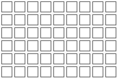

# Конструктор CellPicker

Конструктор CellPicker
-

# Конструктор CellPicker

## Синтаксис

PP.Ui.CellPicker(settings);

## Параметры

settings. JSON-объект со значениями свойств компонента.

## Описание

Конструктор CellPicker создает экземпляр компонента [CellPicker](../../Components/CellPicker/CellPicker.htm).

## Пример

Для выполнения примера подключите ссылки на библиотеку PP.js и таблицы визуальных стилей PP.css. Создадим экземпляр класса CellPicker:

После выполнения примера на html-странице будет размещен компонент [CellPicker](../../Components/CellPicker/CellPicker.htm), имеющий следующий вид:

См. также:

[CellPicker](cellpicker.htm)

		Справочная
		 система на версию 10.9
		 от 18/08/2025,
		 © ООО «ФОРСАЙТ»,
