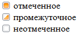

# CheckBox.CheckedState

CheckBox.CheckedState
-

# CheckBox.CheckedState

## Синтаксис

CheckedState: Boolean

## Описание

Свойство CheckedState определяет
 состояние отметки компонента.

## Комментарии

Если для свойства установлено значение true,
 то состояние компонента - отмеченное. Если установлено значение null, то состояние - промежуточное.
 При значении false компонент не
 отмечен. По умолчанию установлено значение false.

Для того чтобы установить промежуточное состояние отметки компонента,
 необходимо свойству [ThreeState](CheckBox.ThreeState.htm) задать
 значение true.

## Пример

Для выполнения примера подключите библиотеку PP.js и таблицы визуальных
 стилей PP.css. Создадим три экземпляра компонента CheckBox,
 для каждого из которых установлено особое состояние отметки:

После выполнения примера на html-странице будут размещены компоненты
 CheckBox, имеющие следующий вид:

 См. также:

[CheckBox](CheckBox.htm)

		Справочная
		 система на версию 10.9
		 от 18/08/2025,
		 © ООО «ФОРСАЙТ»,
