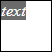

# Clipboard.getCopyPasteHTMLNode

Clipboard.getCopyPasteHTMLNode
-

# Clipboard.getCopyPasteHTMLNode

## Синтаксис

getCopyPasteHTMLNode();

## Описание

Метод getCopyPasteHTMLNode возвращает
 блочный DOM-элемент, содержащий форматируемый текст из буфера обмена.

## Комментарии

Метод возвращает DOM-элемент, содержащий тег 
.

## Пример

Для выполнения примера необходимо наличие на html-странице ссылки на
 файл сценария PP.js. Создадим буфер обмена, скопируем в него форматируемый
 текст в виде html-разметки и отобразим его в блоке 
:

// Создадим объект буфера обмена
var clipboard = new PP.Ui.Clipboard()
// Скопируем фрагмент html-разметки в буфер обмена
clipboard.copy("<i>text<i>", true);
// Получим и отобразим блок с разметкой
var node = clipboard.getCopyPasteHTMLNode();
node.style.opacity = 1;
node.style.width = "50px";
node.style.height = "50px";
node.style.height = "50px";
node.style.zIndex = 0;
node.style.top = "0px";
node.style.left = "0px";
node.style.border = "1px solid #000000"
document.body.appendChild(node);
console.log("Форматируемый текст (HTML) в буфере обмена: " + node.innerHTML);

В результате выполнения пример был создан буфер обмена, а затем вместе
 со своим содержимым он был отображён в блочном элементе 
:

Форматируемый текст, содержащийся в буфере обмена, был выведен в консоль
 браузера:

Форматируемый текст (HTML) в буфере обмена: <i>text</i>

См. также:

[ Clipboard](Clipboard.htm)

		Справочная
		 система на версию 10.9
		 от 18/08/2025,
		 © ООО «ФОРСАЙТ»,
