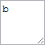

# Clipboard.getCopyPasteTextArea

Clipboard.getCopyPasteTextArea
-

**

# Clipboard.getCopyPasteTextArea

## Синтаксис

getCopyPasteTextArea(settings);

## Параметры

*settings.* Настройки текстовой области.
 Необязательный параметр.

## Описание

Метод getCopyPasteTextArea**
 возвращает DOM-элемент текстовой области, содержащий текст из буфера обмена.

## Комментарии

Метод возвращает DOM-элемент, содержащий тег <textarea>.

## Пример

Для выполнения примера необходимо наличие на html-странице ссылки на
 файл сценария PP.js. Создадим буфер обмена и выведем его содержимое в
 консоль браузера. Затем скопируем в него новый текст и отобразим его в
 виде текстовой области:

// Создадим объект буфера обмена
var clipboard = new PP.Ui.Clipboard({
    Data: "a" // Разместим в буфере обмена строку
})
console.log("Исходный текст в буфере обмена: " + clipboard.paste().getData());
// Скопируем новую текстовую строку в буфер обмена
clipboard.copy("b");
console.log("Новый текст в буфере обмена: " + clipboard.getText());
// Получим и отобразим текстовую область, представляющую буфер обмена
var textArea = clipboard.getCopyPasteTextArea();
textArea.style.opacity = 1;
textArea.style.width = "50px";
textArea.style.height = "50px";
textArea.style.height = "50px";
textArea.style.zIndex = 0;
textArea.style.top = "0px";
textArea.style.left = "0px";
document.body.appendChild(textArea);

В результате выполнения пример был создан буфер обмена, а затем вместе
 со своим содержимым он был отображён в виде текстовой области:

Исходный и скопированный в буфер обмена текст был выведен в консоль
 браузера:

Исходный текст в буфере обмена: a

Новый текст в буфере обмена: b

См. также:

[ Clipboard](Clipboard.htm)

		Справочная
		 система на версию 10.9
		 от 18/08/2025,
		 © ООО «ФОРСАЙТ»,
