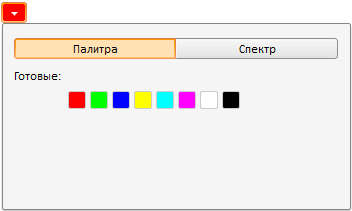

# ColorCombo.PresentedColors

ColorCombo.PresentedColors
-

# ColorCombo.PresentedColors

## Синтаксис

PresentedColors: Array

## Описание

Свойство PresentedColors устанавливает набор стандартных цветов в палитре.

## Комментарии

Цвет может быть задан в следующих форматах:

-
«A=255;R=230;G=230;B=230»;

-
«#FFFFFF»;

-
«#FFFFFFFF»;

-
«White», «Red», «Black» и т.д.

## Пример

Для выполнения примера разместите на html-странице компонент [ColorCombo](../../Components/ColorCombo/ColorCombo.htm) как описано на странице «[Пример создания компонента ColorCombo](../../Components/ColorCombo/Example_ColorCombo.htm)». В JSON-настройки компонента добавьте строку:

PresentedColors: ['#FF0000', '#00FF00', '#0000FF', '#FFFF00', '#00FFFF', '#FF00FF', '#FFFFFF', '#000000']

После выполнения примера при обновлении страницы с компонентом [ColorCombo](../../Components/ColorCombo/ColorCombo.htm) в палитре будет содержаться заданный набор цветов:

См. также:

[ColorCombo](ColorCombo.htm)

		Справочная
		 система на версию 10.9
		 от 18/08/2025,
		 © ООО «ФОРСАЙТ»,
