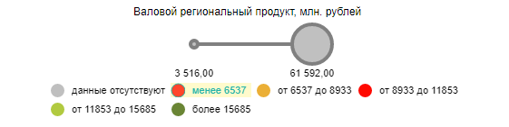

# ColorLegendBase.BetweenFormat

ColorLegendBase.BetweenFormat
-

**

# ColorLegendBase.BetweenFormat

## Синтаксис

BetweenFormat: String;

## Описание

Свойство BetweenFormat определяет
 формат записи интервалов с обеими границами.

## Комментарии

Значение свойства устанавливается из JSON и с помощью метода setBetweenFormat,
 а возвращается с помощью метода getBetweenFormat.**

## Пример

Для выполнения примера необходимо наличие на html-странице компонента
 [BubbleChart](dhtmlBubbleChart.chm::/Components/BubbleChart/BubbleChart.htm)
 с наименованием «bubbleChart» (см. «[Пример
 создания компонента BubbleChart](dhtmlBubbleChart.chm::/Components/BubbleChart/BubbleChart_Example.htm)»). Установим новые
 значения для следующих свойств легенды интервалов значений: формат записи
 интервалов с левой, правой и обеими границами, расположение и текст элемента,
 соответствующего отсутствующим данным в визуализаторе, цвет и прозрачность
 кисти подсветки элементов легенды, цвет подсвеченных элементов. Разрешим
 подсветку элементов легенды, установим режим отображения подсветки по
 щелчку:

// Получим легенду интервалов значений
var legend = bubbleChart.getLegend();
// Установим формат записи интервалов с обеими границами
legend.setBetweenFormat("от {0:0} до {1:0}")
// Установим формат записи интервала с левой границей
legend.setGreaterFormat("более {0:0}");
// Установим формат записи интервала с правой границей
legend.setLessFormat("менее {0:0}");
/*
 Установим расположение элемента, соответствующему отсутствующим данным
 в визуализаторе перед остальными элементами
*/
legend.setNoDataPosition(PP.Ui.NoDataPosition.Before);
// Установим подпись для элемента, соответствующего отсутствующим данным в визуализаторе
legend.setNoDataText("данные отсутствуют");
// Установим цвет и прозрачность кисти для подсветки элементов легенды
var brush = legend.getHighlightBrush();
brush.setColor("#FFE500");
brush.setOpacity(0.2);
legend.setHighlightBrush(brush);
// Установим цвет подсвеченных элементов легенды
legend.setHighlightItemColor("LightSeaGreen");
// Разрешим подсветку элементов легенды
legend.setDoHighlight(true);
// Установим режим отображения подсветки по щелчку
legend.setHoverMode(PP.HoverMode.Click);
// Обновим пузырьковую диаграмму
bubbleChart.refresh();
Щёлкнем по любому элементу легенды интервалов значений.

В результате выполнения примера были изменены следующие свойства легенды:
 формат записи интервалов с левой, правой и обеими границами, расположение
 и текст элемента, соответствующего отсутствующим данным в визуализаторе,
 цвет и прозрачность кисти подсветки элементов легенды, цвет подсвеченных
 элементов; был установлен режим отображения подсветки по щелчку мыши и разрешена
 подсветка элементов легенды:

См. также:

[ColorLegendBase](ColorLegendBase.htm)

		Справочная
		 система на версию 10.9
		 от 18/08/2025,
		 © ООО «ФОРСАЙТ»,
