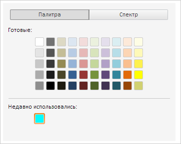

# ColorPanel.updateUsedColors

ColorPanel.updateUsedColors
-

**

# ColorPanel.updateUsedColors

## Синтаксис

updateUsedColors(color: PP.[Color](dhtmlCommon.chm::/Classes/PP/Color/Color.htm));

## Параметры

color. Новый цвет, который
 будет добавлен в начало массива использованных цветов.

## Описание

Метод **updateUsedColors
 обновляет список недавно использованных цветов.

## Пример

Для реализации примера необходимо наличие компонента [ColorPanel](../../Components/ColorPanel/ColorPanel.htm),
 с наименованием colorPanel (см. «[Пример
 создания компонента ColorPanel](Constructor_ColorPanel.htm)»). Добавим обработчик события обновления
 размера цветовой панели:

// Добавляем обработчик события обновления размера цветовой панели
colorPanel.UpdateSize.add(function (sender, args) {
    console.log("Обновлены размеры цветовой панели");
});
Обновим список недавно использованных цветов и добавляем к нему новый
 цвет:

// Обновляем список недавно использованных цветов и добавляем к нему новый цвет
colorPanel.updateUsedColors(new PP.Color(PP.Color.Colors.aqua));
colorPanel.updateSize();
В результате в цветовой панели появятся использованные цвета:

В консоль будет выведено сообщение об обновлении размеров цветовой панели:

Обновлены размеры цветовой панели

См. также:

[ColorPanel](ColorPanel.htm)

		Справочная
		 система на версию 10.9
		 от 18/08/2025,
		 © ООО «ФОРСАЙТ»,
