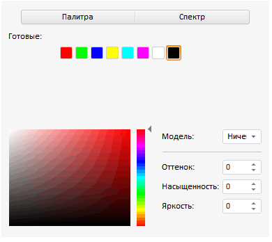

# Конструктор ColorPanel

Конструктор ColorPanel
-

# Конструктор ColorPanel

## Синтаксис

PP.Ui.ColorPanel (settings);

## Параметры

settings. JSON-объект со значениями
 свойств компонента.

## Описание

Конструктор ColorPanel создает
 экземпляр класса [ColorPanel](ColorPanel.htm).

## Пример

Для выполнения примера добавьте ссылки на библиотеку компонентов PP.js,
 файл со стилями PP.css и файл с ресурсами resources.ru.js. В теге BODY
 должен размещаться элемент div с идентификатором «example». В папке «resources»
 должны содержаться папки с ресурсами. Создадим компонент [ColorPanel](../../Components/ColorPanel/ColorPanel.htm):

        PP.resourceManager.setRootResourcesFolder("../resources/"); //путь к папке с ресурсами
        PP.setCurrentCulture(PP.Cultures.ru); //выбор языковых настроек
        var colPanel = new PP.Ui.ColorPanel({
            ParentNode: document.getElementById('example'),
            Color: new PP.Color("#FF0000"),
            Mode: 2,
            ColorChange: function (sender, args) { alert("Выбран цвет") },
            PresentedColors: ['#FF0000', '#00FF00', '#0000FF', '#FFFF00', '#00FFFF', '#FF00FF', '#FFFFFF', '#000000'],
            SpectrumMode: 1,
            PaletteSelected: function (sender, args) { alert("Выбран цвет из палитры") }
        });
        // Добавляем обработчик изменения значения цветовой панели
        colPanel.ValueChanged.add(function(sender, args) {
            console.log("Изменилось значение цветовой панели");
        });
        // Вызываем событие изменения значения цветовой панели после изменения цвета
        colPanel.ColorChange.add(function(sender, args) {
            colPanel.ValueChanged.fire(colPanel);
        });

После выполнения примера на странице будет размещен компонент ColorPanel,
 имеющий следующий вид:

Панель открыта в режиме «Спектр» (Mode: 2), спектр отображается в режиме
 HSV (SpectrumMode: 1). Над спектром отображается список готовых цветов,
 установленный в свойстве [ColorPanel.PresentedColors](ColorPanel.PresentedColors.htm).
 Выбран черный цвет (Color: new PP.Color("#FF0000")). При [смене цвета](ColorPanel.ColorChange.htm) и при [выборе
 цвета из палитры](ColorPanel.PaletteSelected.htm) на экран будут выдаваться соответствующие сообщения,
 также в консоль будет выводиться сообщение об изменении значения цветовой
 панели:

Изменилось значение цветовой панели

См. также:

[ColorPanel](ColorPanel.htm)

		Справочная
		 система на версию 10.9
		 от 18/08/2025,
		 © ООО «ФОРСАЙТ»,
